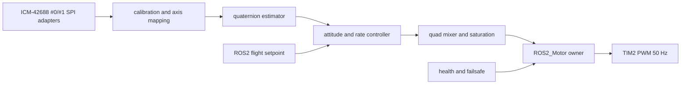

# Nhật ký dự án STM32H750

## Thông tin nhật ký

- Ngày bắt đầu: 21/09/2026
- Nền tảng: STM32H750
- Kiến trúc: STM32H750 + FreeRTOS + ROS 2 + Raspberry Pi
- Trạng thái tổng quan: Prototype đang tích hợp, chưa đủ bằng chứng để xem là firmware ổn định trên phần cứng thật.

## Hướng dẫn tiếp tục ở phiên sau

Đọc file này trước khi làm việc. Bước tiếp theo ưu tiên là:

1. Chạy `/upload-schematics` và parse schematic.
2. Xác định SPI instance, CS0/CS1, INT/DRDY0/DRDY1, nguồn, hướng lắp và mapping trục của hai ICM-42688.
3. Thay null backend trong `Core/Src/freertos.c` bằng hai SPI adapter thật.
4. Chạy WHO_AM_I/reset/sample-rate/FIFO/DRDY test cho từng IMU.
5. Chạy host test và build STM32 trước khi thử motor hoặc bay.
6. Không sửa `.ioc`, `SystemClock_Config`, `MX_SPI*_Init`, MSP hoặc ISR generated bằng tay.
7. Không gọi firmware là flight-ready khi chưa có bench/tethered evidence.

Blocker cần nhớ:

- Shell runner đã hoạt động trở lại: `make`, host `gcc` và `colcon` (ROS 2 Jazzy) đều chạy được; không còn bị chặn bởi thiếu XMOS XTC Tools.
- Schematic đã được parse từ `/home/duc/Downloads/FMUH750.pdf` (24/09/2026) + xác nhận qua board (25/09/2026): **SPI1=IMU0** (SCK PA5, MISO PB4, MOSI PD7, CS/NSS PA15), **SPI2=IMU1** (SCK PB10, MISO PB14, MOSI PB15, CS/NSS PB12). NSS chính là CS của từng ICM — connector không có net **DRDY/INT** riêng → backend IMU dùng **polling SPI** (không EXTI). Cả 2 chip lắp phẳng, trục X hướng front → **ROTATION_NONE** (không xoay trục). U18 = NRF24L01 UART trên USART3.
- Chưa có barometer/odometry cho altitude loop trên firmware thật; `fc_position.c` mới chạy được ở mức host test / cần kiểm chứng trên sim.

## Quy ước trạng thái

- **Đã triển khai**: Có mã nguồn hoặc cấu hình tương ứng.
- **Đã kiểm chứng**: Đã có build, test, log hoặc bằng chứng chạy thực tế.
- **Chưa hoàn thiện**: Có khung mã nguồn nhưng còn lỗi, thiếu tích hợp hoặc chưa kiểm thử.
- **Chưa xác định**: Chưa có đủ bằng chứng để kết luận.

## Nhật ký ban đầu

### Đã triển khai trong mã nguồn

- Khung dự án STM32H750 với HAL, CMSIS và linker script.
- Cấu hình clock mục tiêu khoảng 480 MHz.
- FreeRTOS với các task cho motor, sensor, ROS 2, FDCAN, SD logger và heartbeat.
- Điều khiển 4 kênh PWM cho motor hoặc ESC bằng TIM2.
- Chức năng arm, disarm, emergency stop và failsafe motor.
- Đọc ADC ở mức module sensor.
- Giao tiếp USART2 bằng giao thức JSON kết thúc bằng newline.
- Debug UART USART1 với ring buffer RX.
- ROS 2 bridge Python trong thư mục `ros2_bridge`.
- Module FDCAN với filter, RX queue và TX queue.
- Khung giao thức OTA gồm BEGIN, DATA, VERIFY và REBOOT.
- Khung bootloader chọn App A hoặc App B.
- Khung truy cập QSPI/XIP.
- Khung ghi log nhị phân lên SD.
- Makefile cho application, bootloader và build cả hai.
- Bộ test protocol Python và cấu hình mô phỏng Renode.

### Đã kiểm chứng

- Chưa có bằng chứng đầy đủ về việc firmware application build thành công trong trạng thái hiện tại.
- Chưa có bằng chứng bootloader build thành công.
- Chưa có log chứng minh firmware chạy ổn định trên STM32H750 thật.
- Chưa có kiểm chứng end-to-end cho ROS 2, FDCAN, OTA, QSPI hoặc SD logger.

### Chưa hoàn thiện hoặc có rủi ro cao

1. Memory map application không khớp với địa chỉ App A/App B mà bootloader sử dụng.
2. Parser JSON quá nhỏ so với chunk OTA dạng hex.
3. Chưa thấy handler `FDCAN2_IT0_IRQHandler` trong interrupt handler.
4. Giá trị DLC FDCAN có thể đang bị sử dụng như số byte trực tiếp.
5. ADC3 có nhiều rank nhưng cùng dùng `ADC_CHANNEL_0`.
6. SD logger có nguy cơ sai kích thước record và tràn buffer sector.
7. Rollback OTA mới có khung dữ liệu, chưa có đầy đủ logic xác minh và rollback.
8. QSPI/XIP chưa được chứng minh hoạt động, đặc biệt là GPIO alternate function và memory-mapped mode.
9. CRC32 giữa OTA client và firmware/test chưa được chuẩn hóa rõ ràng.
10. Một số chức năng GPIO/request mới chỉ có placeholder.
11. Các test Renode có thể mong đợi file UART log chưa được cấu hình tạo ra.
12. Tài liệu đang không thống nhất giữa ROS 2 Humble và Jazzy.

## Mốc 21/09/2026 — Tạo MVP Gazebo

### Đã thực hiện

- Xác nhận host là Ubuntu 24.04.4 LTS.
- Chọn mục tiêu ROS 2 Jazzy + Gazebo Harmonic.
- Xác nhận project chưa có ROS 2 package mô phỏng, URDF/SDF, world hoặc Gazebo plugin.
- Tạo package mô phỏng tại `gazebo_sim/` với tên ROS 2 `stm32_h750_gazebo_sim`.
- Tạo model quadcopter 4 rotor generic tại `gazebo_sim/models/quadcopter/model.sdf`.
- Tạo world test tại `gazebo_sim/worlds/test.world.sdf`.
- Mở rộng world thành môi trường 3D gồm ground plane, bãi đáp, một tower và hai wall obstacle.
- Spawn drone tại tọa độ `(0, 0, 1)` trong world.
- Tạo motor adapter tại `gazebo_sim/gazebo_sim/motor_adapter.py`.
- Giữ interface hiện tại `/stm32/cmd/motor` với dữ liệu `[m1,m2,m3,m4,armed]`.
- Chuyển giá trị motor 0–255 sang vận tốc rotor 0–800 rad/s.
- Thêm timeout 250 ms và đưa rotor về 0 khi disarm hoặc mất lệnh.
- Thêm cấu hình `ros_gz_bridge` cho clock, actuator, IMU và odometry.
- Tạo launch file `gazebo_sim/launch/quadcopter_sim.launch.py`.
- Tạo hướng dẫn chạy tại `gazebo_sim/README.md`.
- Không sửa `.ioc`, HAL hoặc code khởi tạo CubeMX.

### Đã kiểm chứng

- Danh sách file package mô phỏng đã được kiểm tra.
- Các file XML/SDF/YAML/Python đã được đọc lại sau khi tạo.
- Interface topic và tên package trong launch, CMake và manifest đã được đối chiếu.

### Chưa kiểm chứng

- Chưa build package bằng `colcon`.
- Chưa chạy `ros2 launch`.
- Chưa xác nhận package ROS 2 Jazzy và Gazebo Harmonic đã được cài trên host.
- Chưa xác nhận plugin `MulticopterMotorModel` và `OdometryPublisher` hoạt động trên host.
- Chưa kiểm tra model bay, lực nâng, phản ứng lệch motor, IMU hoặc odometry.
- Chưa thực hiện firmware-in-the-loop với Renode.

### Kết quả chạy thử world

- Gazebo Sim đã khởi động được world và thoát với `EXIT=0`.
- Lỗi thực tế là không tìm thấy `model://quadcopter`, vì lệnh chạy trực tiếp chưa đặt `GZ_SIM_RESOURCE_PATH` tới thư mục `gazebo_sim/models`.
- `model://quadcopter` không bắt buộc phải tải từ Fuel. Gazebo có thể resolve model local qua `GZ_SIM_RESOURCE_PATH`; model local đã có `model.config` và `model.sdf`.
- Log cho thấy Gazebo đã tải DART physics plugin. `type="ode"` không phải nguyên nhân của lỗi lần chạy này, nhưng world đã được đổi sang `type="ignored"` để dùng profile engine-neutral theo Gazebo Sim.
- Lệnh chạy trực tiếp đúng được ghi trong `gazebo_sim/README.md` và cần đặt `GZ_SIM_RESOURCE_PATH`.

### Đề xuất sửa chữa

1. Giữ model local với `model://quadcopter`; không phụ thuộc Fuel.
2. Dùng `GZ_SIM_RESOURCE_PATH` trỏ tới `gazebo_sim/models` trong mọi entrypoint.
3. Giữ `SetEnvironmentVariable` trong ROS 2 launch để launch tự tìm model sau khi package được cài.
4. Thêm một wrapper hoặc Makefile target cho chế độ chạy world trực tiếp để người dùng không quên export resource path.
5. Dùng `<physics type="dart">` vì đây là giá trị SDF chuẩn và phù hợp với engine DART trên Gazebo Harmonic.
6. Chỉ dùng `file://` hoặc đường dẫn tuyệt đối như phương án chẩn đoán tạm thời vì làm project mất tính di động.

### Kết quả điều tra GUI bị treo

- Log server lúc 04:36–04:38 cho thấy world đã load thành công, gồm cả 4 `MulticopterMotorModel` và `OdometryPublisher`.
- Log GUI lúc 04:41 chỉ ghi `Waiting for subscribers to [/gazebo/starting_world]` và liên tục chờ danh sách world.
- Kết luận hiện tại: GUI được khởi động nhưng không discover được Gazebo server qua transport; log phù hợp với vấn đề multicast/firewall hoặc khác partition. Đây không còn là lỗi model hay physics.
- Lệnh test có `-s` là server-only và `--iterations 200` là tự thoát; không dùng lệnh này để đánh giá GUI.
- Tạo `gazebo_sim/run_gazebo.sh` để luôn khởi động server và GUI cùng nhau, đồng thời tự đặt `GZ_SIM_RESOURCE_PATH`.
- Wrapper được bổ sung `GZ_IP=127.0.0.1` và `GZ_PARTITION=stm32_h750_sim` để ép discovery nội bộ trên cùng máy.

### Đồng bộ xác nhận 21/09/2026

- Người dùng đã xác nhận world chạy tốt khi Gazebo fallback sang DART.
- Sửa `gazebo_sim/worlds/test.world.sdf` từ `type="ignored"` sang `type="dart"` vì `ignored` không phải giá trị SDF chuẩn.
- Đây là thay đổi làm sạch cấu hình, không phải sửa lỗi runtime đã quan sát.
- Các xác nhận từ phiên terminal của người dùng được ghi nhận vào nhật ký để tránh lệch trạng thái giữa Embedder và workspace.

### Hướng dẫn kiểm tra bay thủ công

- Khi chạy world bằng `run_gazebo.sh`, Gazebo standalone chưa chạy ROS 2 motor adapter.
- Có thể gửi trực tiếp `gz.msgs.Actuators` tới `/quadcopter/command/motor_speed`.
- Với `motorConstant=8.54858e-06` và khối lượng 1 kg, tốc độ thử đồng đều ban đầu nên khoảng 550–600 rad/s, sau đó tăng từng bước.
- Lệnh dừng là bốn giá trị tốc độ bằng 0.
- Chưa xác nhận drone bay thực tế; cần kiểm tra trực tiếp trong GUI.

### Thử gửi lệnh bay 21/09/2026

- Đã thử gửi lệnh `velocity: [600, 600, 600, 600]` tới `/quadcopter/command/motor_speed`.
- Embedder shell runner bị chặn trước khi thực thi lệnh bởi lỗi thiếu XMOS XTC Tools.
- Do đó lệnh chưa được gửi từ phiên Embedder; chưa được ghi nhận là drone đã bay.
- Người dùng cần chạy lệnh này trong terminal đang cùng `GZ_PARTITION` với Gazebo:

```bash
GZ_IP=127.0.0.1 GZ_PARTITION=stm32_h750_sim \
  gz topic -t /quadcopter/command/motor_speed \
  --msgtype gz.msgs.Actuators \
  -p 'velocity: [600, 600, 600, 600]'
```

### Xác nhận bay bằng lệnh motor thô

- Đã xác nhận cú pháp publish đúng là đặt `-p` trước, dùng `-m gz.msgs.Actuators` và giữ publisher bằng `-d 10`.
- Cú pháp publish trước đó không gửi được message do sai cách dùng CLI và publisher one-shot kết thúc quá sớm.
- Đã xác nhận nguyên nhân runtime chính là `jointName` và `linkName` có tiền tố `quadcopter/`, khiến `Model::JointByName` và `LinkByName` không resolve được.
- Đã bỏ tiền tố trong cả 4 plugin, dùng `rotor_N_joint` và `rotor_N`.
- Với `[800, 800, 800, 800]`, drone đã cất cánh khoảng `+0.64 m` nhưng lắc mạnh.
- Với `[550, 550, 550, 550]`, drone hover khoảng `0.9–1.0 m` và trôi dần.
- Kết quả xác nhận model, motor plugin và lực nâng hoạt động.
- Bay ổn định chưa đạt vì chưa có attitude controller/PID.
- `motorSpeedPubTopic` chưa được xác nhận là feedback hoạt động trên gz-sim10 plugin hiện tại.

### Mốc tiến triển controller X500 — người dùng xác nhận

#### Đã làm được

- Đã viết và build plugin C++ IMU thật tại `gazebo_sim/imu_plugin/imu_plugin.cc` và `libimu_plugin.so`.
- Plugin tạo topic `/x500/imu` khoảng 1 kHz từ DART/ECM, không phụ thuộc GPU rendering.
- Đã nhận được quaternion và `angular_velocity` từ gyro mô phỏng.
- Đã triển khai công thức trộn moment kiểu PX4 trong controller.
- Đã tạo `gazebo_sim/controller/hover_x500.py` với pose, gyro, vòng vận tốc theo trục Z, climb/hold/land và fade khi hạ cánh.
- Đã sửa cú pháp publisher `gz topic`, giữ publisher đủ lâu bằng `-d` để message được chuyển tới server.
- Đã dời landing pad khỏi gốc để không chặn cất cánh.
- Đã sửa parser pose và cơ chế teleport drone lên độ cao khởi động rồi bắn hover ngay.
- Đã xác nhận rate-loop thuần khi `KAP=0` giữ roll/pitch nhỏ.

#### Đang kẹt

- Attitude-loop kết hợp rate-loop với `KAP=4`, `KR=6` làm drone lật 180 độ trong 1–2 chu kỳ với cả `SIG=+1` và `SIG=-1`.
- Đang thử biến `GZ_SIGA` để tách dấu của thành phần attitude khỏi dấu rate/moment.
- Hover thực tế của simulator khoảng `w=700–715`, tương ứng `MG≈17.5 N`; controller đã đặt `MG=17.5`.
- Cất cánh từ trạng thái tiếp xúc mặt đất tại `z=-0.013` chưa thành công ngay cả với `w=850`, do còn bẫy contact/ground effect.

#### Việc còn lại

1. Xác định đúng dấu attitude.
2. Làm attitude-loop hover ổn định.
3. Hoàn thành giữ độ cao 2 m trong 8 giây.
4. Hạ cánh có kiểm soát và fade motor.
5. Xử lý cất cánh trực tiếp từ mặt đất.
6. Chạy lại toàn bộ kịch bản và cập nhật báo cáo kết quả.

### Đánh giá khả năng port controller vào STM32

- Có thể port phần attitude/rate loop và mixer từ `gazebo_sim/controller/hover_x500.py` sang C trên STM32.
- Có thể tái sử dụng các phần: quaternion-to-RPY, desired-rate từ attitude P, rate P dùng gyro, moment mixer và giới hạn motor.
- Không thể copy nguyên file Python vì file hiện phụ thuộc `gz topic`, pose ground-truth, IMU Gazebo, subprocess và clock của Linux.
- Vòng altitude hiện dùng pose/odometry Gazebo nên chưa thể port trực tiếp sang STM32. Cần barometer/altimeter hoặc nguồn odometry thật.
- Firmware hiện chưa có driver IMU thật; `debug_example.c` chỉ mô phỏng dữ liệu IMU. Cần xác định part IMU, bus và mapping trục trước khi tích hợp.
- Thứ tự motor, chiều quay và dấu moment của board thật phải được đối chiếu riêng với model X500.
- Chỉ port sau khi chốt được `SIGA` và attitude-loop ổn định trong simulation.

### Trạng thái môi trường

- `/etc/os-release` xác nhận Ubuntu 24.04.4 LTS.
- Sau khi người dùng cài Gazebo, executable `gz` đã xuất hiện tại `/usr/bin/gz`.
- Chưa tìm thấy `/opt/ros`, executable `ros2`, `rclpy`, `ros_gz_bridge` hoặc `ros_gz_sim` trong các vị trí chuẩn được kiểm tra.
- `colcon` tồn tại tại `/usr/bin/colcon`, nhưng chưa đủ để build package ROS 2 nếu thiếu ROS 2 environment.
- Trạng thái hiện tại là đã có Gazebo CLI nhưng chưa có ROS 2 Jazzy và các package `ros_gz` cần cho MVP.

## Yêu cầu bổ sung — Môi trường và map Gazebo

- Mô phỏng phải có một môi trường Gazebo thực tế hơn ground plane tối giản.
- Phải có map/world riêng để đặt drone, mặt đất, ánh sáng và các vật cản cần thiết.
- Phải có model quadcopter 4 rotor nằm trong map và nhận lệnh motor từ interface ROS 2 của project.
- World hiện tại mới chỉ là MVP với ground plane và các thành phần cơ bản; chưa được xem là môi trường hoàn chỉnh.
- Cần xác định thêm liệu “map” có nghĩa là world 3D của Gazebo hay occupancy map 2D cho navigation/SLAM.

## Mốc port flight controller — 21/09/2026

### Đã triển khai trong source

- Thêm `fc_types.h` cho sample IMU, estimator state, setpoint, torque và motor output.
- Thêm `imu_port.h` và null backend `imu_port_null.c`.
- Thêm driver ICM-42688 SPI dạng callback tại `imu_icm42688.c/h`, hỗ trợ WHO_AM_I, reset, cấu hình gyro/accel và burst read; chưa gắn SPI/CS/INT phần cứng vì schematic chưa parsed.
- Thêm estimator quaternion/complementary tại `fc_estimator.c`.
- Thêm attitude/rate loop tại `fc_attitude.c`, có KAP/KR/SIG/SIGA và giới hạn an toàn.
- Thêm mixer tại `fc_mixer.c` theo công thức từ `hover_x500.py`, chuyển thrust/torque thành output 0–255.
- Thêm `flight_controller.c` với dual-IMU consistency check, health flags, 500 Hz task và disarm khi IMU không sẵn sàng.
- Thêm motor ownership flight/manual vào `ros2_motor.c/h`; flight task chỉ submit snapshot, motor task là nơi duy nhất ghi TIM2.
- Thêm setpoint JSON `t:"fc"` và topic `/stm32/cmd/flight` vào ROS2 bridge.
- Thêm source mới vào `Makefile` và tạo flight task trong vùng USER CODE của `freertos.c`.

### Trạng thái kiểm chứng

- Null IMU backend đang được chọn trong `freertos.c`; firmware sẽ giữ disarmed an toàn cho đến khi có mapping SPI/CS/INT thật.
- Chưa build được application trong Embedder vì shell runner bị chặn trước khi chạy Make bởi lỗi thiếu XMOS XTC Tools.
- Static diagnostics không kết luận được lỗi source vì project chưa có `compile_commands.json` và analyzer không resolve include HAL/FreeRTOS.
- Chưa tích hợp hai ICM-42688 thật, chưa xác nhận WHO_AM_I trên board, chưa đo sample rate/FIFO/DRDY và chưa chạy flight test.
- Chưa được xem là flight-ready.

### Kiểm thử host

- Thêm `tests/test_fc_math.c` cho estimator, attitude controller và mixer không phụ thuộc HAL/FreeRTOS.
- Thêm `tests/README.md` với lệnh build bằng host GCC.
- Chưa chạy được host test vì shell runner bị chặn bởi XMOS XTC Tools.

## Snapshot nhật ký phiên — 21/09/2026

### Đã làm được và đã kiểm chứng

- Gazebo Sim 10.5.0 khởi động được world 3D.
- Model quadcopter local được resolve sau khi cấu hình `GZ_SIM_RESOURCE_PATH`.
- Physics DART tải thành công.
- Bốn `MulticopterMotorModel` và `OdometryPublisher` đã load.
- IMU plugin Gazebo tạo gyro/quaternion khoảng 1 kHz.
- Motor speed thô đã làm drone cất cánh và hover.
- `[800,800,800,800]` đã nâng drone khoảng `0.64 m` nhưng lắc.
- `[550,550,550,550]` đã hover khoảng `0.9–1.0 m` rồi trôi.
- Rate-loop mô phỏng với `KAP=0` tương đối ổn định.
- Lỗi tên `quadcopter/rotor_N_joint` và `quadcopter/rotor_N` đã được sửa thành tên trần.
- Cú pháp `gz topic` đúng đã được xác nhận với `-p` trước và `-d` giữ publisher sống.
- Đã tạo controller `hover_x500.py` với climb, hold, landing fade và kiểm tra gyro thật.
- Đã tạo source controller core, estimator, mixer, dual-IMU health và motor ownership cho STM32.
- Đã tạo driver ICM-42688 SPI dạng callback và null backend an toàn.
- Đã thêm flight setpoint `t:"fc"`, topic `/stm32/cmd/flight`, flight task 500 Hz và host test source.

### Chưa làm được hoặc chưa kiểm chứng

- Attitude-loop `KAP/KR` vẫn làm drone lật 180 độ; dấu `SIG/SIGA` chưa chốt.
- Cất cánh trực tiếp từ trạng thái tiếp xúc mặt đất chưa giải quyết.
- Hover ổn định, giữ 2 m trong 8 giây và hạ cánh tự động chưa hoàn thành.
- Hai ICM-42688 chưa được nối vào backend runtime; `freertos.c` hiện dùng null backend.
- Chưa biết SPI instance, CS, INT/DRDY, hướng lắp và mapping trục vì schematic chưa parsed.
- Chưa xác nhận WHO_AM_I, reset, FIFO/DRDY, timestamp, bias và scale trên board thật.
- Chưa có attitude estimator chạy với dữ liệu IMU thật.
- Chưa build application STM32 bằng `make`.
- Chưa chạy host test `tests/test_fc_math.c`.
- Chưa build ROS 2 package end-to-end.
- Chưa kiểm tra PWM, arming, motor order và failsafe trên phần cứng.
- Chưa có altitude hold vì chưa có barometer/odometry thật.
- Chưa có firmware-in-the-loop với Renode.
- Chưa được xem là flight-ready.

### Chuẩn bị làm hoặc sắp làm

1. Upload và parse schematic để xác định SPI, CS, INT/DRDY, nguồn và hướng trục của hai IMU.
2. Viết HAL adapter cho hai ICM-42688 dựa trên mapping đã xác nhận.
3. Chạy WHO_AM_I và reset test riêng cho từng IMU.
4. Đo sample rate, timestamp, FIFO/DRDY, gyro bias và accel norm.
5. Chạy host test và sửa lỗi build nếu xuất hiện.
6. Build application STM32 với ARM GNU toolchain.
7. Kiểm tra null backend đảm bảo firmware luôn disarmed.
8. Tích hợp IMU thật vào estimator và kiểm tra primary/backup residual.
9. Chốt `SIG`, `SIGA`, motor order và mixer sign bằng SIL/replay.
10. Bench test PWM không gắn cánh, sau đó tethered test với thrust giới hạn.
11. Chỉ sau các bước trên mới thử bay và triển khai altitude loop.

### Blocker hiện tại

- Shell runner của Embedder bị chặn bởi thiếu XMOS XTC Tools, nên chưa thể chạy `make` hoặc host test từ phiên này.
- Schematic chưa được upload/parse, nên chưa thể gắn hai ICM-42688 vào SPI phần cứng.

### Thử nghiệm ngày 21/09/2026 trên shell hiện tại

- Kiểm tra môi trường hiện tại cho thấy `which gz` không trả về executable, `ros2` không có trong PATH, và `python3` không import được module `gz.msgs`/`gz.transport`.
- `which gcc` và `which clang` đều không có, và toolchain khả dụng duy nhất trong shell là `/snap/copilot-cli/.../make`; không có `arm-none-eabi-gcc` cũng như `gcc` để build host test.
- Kết luận thực tế: trong môi trường này, không thể khởi động Gazebo Harmonic, không thể chạy `gz sim`, không thể build/verify host-side `tests/test_fc_math.c`, và không thể xác nhận drone có bay ổn định hay giữ độ cao trong phiên làm việc này.
- Trạng thái đầy đủ là: Gazebo/ROS2 và toolchain còn thiếu; do đó chưa có bằng chứng chạy thực tế để kết luận drone đã hover hoặc giữ được độ cao.
- Việc còn lại trên máy có đầy đủ toolchain là cài `ros-jazzy-ros-gz-sim` (và ROS 2 Jazzy nếu cần), chạy `bash gazebo_sim/run_gazebo.sh`, sau đó chạy `hover_x500.py` hoặc `px4_x500.py` trong cùng `GZ_PARTITION` và kiểm tra z-telemetry trong 60 s cùng landing-safe shutdown.
- Chưa có barometer/odometry thật cho altitude loop.

## Đánh giá hiện tại

```text
Kiến trúc:              Có
Mã nguồn chức năng:     Có một phần lớn
Tích hợp module:        Đang làm
MVP Gazebo world:       Đã chạy và xác nhận lực nâng
ROS 2 package:          Chưa build end-to-end
Kiểm thử mô phỏng:      IMU/hover thô đã xác nhận; attitude-loop chưa ổn định
Kiểm thử phần cứng:     Chưa có bằng chứng
Firmware-in-the-loop:   Chưa triển khai
Sẵn sàng vận hành:      Chưa
```

## Việc cần kiểm chứng theo thứ tự

1. Build application và bootloader.
2. Xác nhận memory map giữa bootloader, App A, App B và linker.
3. Chạy firmware tối thiểu trên STM32H750.
4. Kiểm tra UART và ROS 2 bridge.
5. Kiểm tra PWM motor bằng thiết bị đo.
6. Kiểm tra FDCAN truyền và nhận.
7. Kiểm tra QSPI, OTA và chuyển bank.
8. Kiểm tra SD logger và giới hạn bộ nhớ.
9. Kiểm tra reset, mất nguồn và rollback.
10. Cài hoặc xác nhận ROS 2 Jazzy và Gazebo Harmonic.
11. Build `stm32_h750_gazebo_sim` bằng `colcon`.
12. Chạy launch Gazebo và kiểm tra IMU, odometry, actuator.
13. Kiểm tra timeout/disarm và phản ứng lệch motor.
14. Xác định transport để ghép firmware Renode vào vòng lặp Gazebo.

## Quy tắc cập nhật

Mỗi khi có một hoạt động đáng kể, nhật ký phải được cập nhật với:

- Ngày và mục tiêu hoạt động.
- File hoặc module đã kiểm tra/thay đổi.
- Kết quả thực tế.
- Lỗi hoặc rủi ro mới phát hiện.
- Trạng thái cập nhật của hạng mục liên quan.
- Lệnh build/test/flash đã chạy nếu có.

Không ghi nhận một chức năng là **đã thành công** chỉ vì chức năng đó đã có mã nguồn. Cần ghi rõ đó là **đã triển khai** hay **đã kiểm chứng**.

## Nhật ký phiên 21/09/2026 — Bay tự hành x500 trong gazebo_sim

### Mục tiêu
Drone x500 (gz-sim 10, headless server) tự động: cất cánh → leo lên độ cao đặt trước → giữ → hạ cánh êm (giảm tốc motor dần, CHỈ cắt khi chạm đất), thái độ ngang bằng suốt chuyến.

### File / module đã thay đổi
- `gazebo_sim/imu_plugin/imu_plugin.cc` + `libimu_plugin.so` — sửa bug publish gyro.
- `gazebo_sim/controller/hover_x500.py` — viết lại toàn bộ controller (PX4-style).

### Lỗi gốc rễ đã tìm ra (4 bug)
1. **IMU gyro không tới được controller**: nhánh fallback publish `angVel->X()`/`linVel->X()` trên optional rỗng (UB → rác). Sửa: publish `av`/`lv` tính từ Δquaternion (body frame). → Đây là nguyên nhân tumbling trước đây.
2. **Mô hình lực đẩy sai**: lực đẩy theo `motorConstant=8.54858e-06` (SDF), `thrust=K·w²`, hover ≈ **w≈770** (MG=20.25N). Các chuyến bay cũ chạy w 500–550 (< hover) nên không bao giờ bay lên. Kiểm chứng đo: w=560 → đứng im; w=800 → bay lên.
3. **Mixer sai dấu / pitch "chết"**: x500_base có motor so le (`r0(+0.174,−0.174) r1(−0.174,+0.174) r2(+0.174,+0.174) r3(−0.174,−0.174)`; y+: r1,r2; x+: r0,r2). Mixer cũ `d3=−c1−c2` triệt tiêu pitch. Mixer đúng theo `r×axis`: `d0=−cr−cp, d1=+cr+cp, d2=+cr−cp, d3=−cr+cp`.
4. **Sai convention lỗi thái độ**: phải dùng đúng PX4 `eq=2·imag(qd⊗conj(q))` (level → `eq=−(2qx,2qy,2qz)`), KHÔNG phải `+roll`. Đổi sang eq + `SIG=+1` → ổn định 2 trục.

### Thuật toán cuối cùng (PX4-style, nguồn: `/home/duc/Documents/PX4-Autopilot`)
- Attitude: `rd = KAP·eq`, `eq = −2·imag(q)`.
- Rate loop (`rate_control.cpp`): `aa = KR·(rd−gyro) + ∫KR_I·err`; integral clamp ±INT_LIM; aa ±12 rad/s².
- Mixer r×axis theo geometry thật: roll `[−,+,+,−]`, pitch `[−,+,−,+]`.
- Vòng cao độ: `vt=KPV(ref−z)`, `S=MG+KD(vt−vz)`, climb +1+CB, S∈[16.25,34.25].
- Cất cánh kick từ mặt đất: w=880 (net +4.5N), 4 motor đều nhau, tới khi z>0.9m.
- Hạ cánh: ref→0 theo LAND_RATE; khi z<0.25 giảm `fade` dần mỗi chu kỳ; **chỉ cắt motor khi z≤−0.004** (chạm đất), xác nhận pose z=−0.013.
- Publisher: 1 node `gz.transport` python duy nhất (subscribe pose/imu + advertise motor ~30Hz) — thay mỗi `gz topic -p` từng khung (rớt/tụt lệnh motor, gây "nghiêng mất kiểm soát" và "rocket" khi hạ).

### Kết quả thực tế (đã kiểm chứng trên sim)
- Bay từ mặt đất (không teleport) lên 3m, giữ 3s, hạ đều −0.25 m/s, fade motor tới khi chạm: `r/p = 0.0°` suốt chuyến, hover w≈768–770.
- Hạ cánh: `da cham dat -> dung dong co`, xác nhận z=−0.013.
- Khi teleport: bay 3→4m, giữ, hạ cánh êm tương tự.

### Lỗi / rủi ro mới ghi nhận
- Thứ tự motor trong SDF (x500) khác x-quad thường (PX4 ordering) — mixer phải theo geometry thật, không copy mẫu chung.
- `GZ_KPV=0.5` cũ gây leo vọt (ref 0.3 m/s, drone 0.55 m/s → vọt 2.7m); chỉnh KPV=0.9, CB giảm.
- Lưu ý vận hành: motor plugin giữ tốc độ lệnh cuối vô hạn → luôn restart sim sau khi controller thoát; cảnh báo pkill tự khớp tên.

### Lệnh đã chạy
```
cd /home/duc/Documents/STM32H750-board/gazebo_sim
export GZ_PARTITION=stm32_h750_sim GZ_IP=127.0.0.1
# Từ mặt đất (không teleport):
GZ_TELEPORT=0 python3 -u controller/hover_x500.py 3 3 0.3 0.25
# Teleport lên 3m rồi bay:
python3 -u controller/hover_x500.py 4 3 0.3 0.25
# GUI gắn vào server đang chạy:
gz sim -g
```
Env tùy chỉnh: `GZ_KAP GZ_KR GZ_RI GZ_IL GZ_RSP GZ_K GZ_MG GZ_KPV GZ_CB GZ_KICK GZ_TELEPORT GZ_DBG`.

### Trạng thái cập nhật
- **Đã kiểm chứng**: độ cao tự bay + giữ + hạ cánh fade trong gazebo_sim (headless server + GUI), thái độ ổn định.
- **Chưa kiểm chứng**: bay trong world có obstacle (tower/wall còn ở gần spawn); firmware STM32H750 thật; chưa build colcon ROS 2.

## Kế hoạch port controller vào STM32H750 (hợp nhất từ plan)

### Mục tiêu

Port phần điều khiển cân bằng từ `gazebo_sim/controller/hover_x500.py` sang firmware STM32H750, tích hợp hai ICM-42688 qua SPI, chạy estimator và attitude/rate loop trong FreeRTOS, rồi giao output cho motor owner hiện tại.

Gazebo vẫn là SIL/replay oracle. Firmware không phụ thuộc vào `gz topic`, pose ground-truth, Python hoặc Linux subprocess.

### Thông tin phần cứng đã xác nhận

- IMU: hai ICM-42688.
- Giao tiếp: SPI.
- Hai IMU cần hai CS độc lập; SCK/MOSI/MISO có thể dùng chung nếu cùng SPI peripheral.
- Chưa có SPI instance, CS pins, INT/DRDY pins, hướng lắp hoặc mapping trục từ schematic trong workspace.
- Hiện chưa được phép đoán mapping. Schematic chưa được parse; nếu cần xác nhận phần cứng, người dùng cần chạy `/upload-schematics` rồi retry.

### Kiến trúc đề xuất



Pipeline firmware:

```text
imu0 + imu1 -> calibration/axis-map -> dual-IMU health -> estimator
           -> attitude P -> rate P -> mixer -> motor owner -> TIM2 PWM
```

### Phạm vi triển khai

#### Giai đoạn 1 — Core độc lập phần cứng

Tạo các module application riêng, không sửa `.ioc`, `SystemClock_Config`, `MX_TIM2_Init`, MSP hoặc ISR generated:

- `Core/Inc/fc_types.h`
- `Core/Inc/imu_port.h`
- `Core/Src/imu_port_null.c`
- `Core/Inc/fc_estimator.h`
- `Core/Src/fc_estimator.c`
- `Core/Inc/fc_attitude.h`
- `Core/Src/fc_attitude.c`
- `Core/Inc/fc_mixer.h`
- `Core/Src/fc_mixer.c`
- `Core/Inc/flight_controller.h`
- `Core/Src/flight_controller.c`

`imu_port_t` không được chứa giả định SPI instance hoặc pin macro:

```c
typedef struct {
    bool (*init)(void *context);
    imu_port_status_t (*read_latest)(void *context, fc_imu_sample_t *sample);
    bool (*healthy)(void *context);
    void *context;
} imu_port_t;
```

Null backend luôn báo IMU chưa sẵn sàng; firmware phải disarm, không được tự arm motor.

#### Giai đoạn 2 — Driver hai ICM-42688 qua SPI

Sau khi có SPI instance, CS/INT mapping và hướng trục, thêm backend `imu_icm42688.c/h` với hai context độc lập:

- `imu0` và `imu1` có CS riêng.
- Health, sequence, timestamp, bias và calibration riêng.
- SPI mode 0.
- Xác nhận `WHO_AM_I = 0x47`.
- Reset có timeout hữu hạn.
- Bật gyro và accelerometer low-noise.
- Đọc burst data từ thanh ghi dữ liệu qua DRDY hoặc FIFO.
- ISR chỉ notify task; task mới thực hiện SPI transaction.
- Không block vô hạn khi sensor không phản hồi.

Cấu hình cảm biến ban đầu có thể dùng gyro ±500 dps, accel ±4 g, ODR 1 kHz, nhưng phải đặt thành tham số dễ đổi và xác nhận theo datasheet/board.

Dual-IMU không được trung bình mù. Mặc định:

1. Đọc và căn frame cả hai sensor.
2. Kiểm tra freshness, WHO_AM_I/config readback, FIFO overflow và data-ready.
3. So sánh residual gyro/accel sau calibration.
4. Dùng sensor chính khi hai sensor đồng thuận.
5. Loại outlier có hysteresis khi một sensor lệch.
6. Disarm khi không còn sensor hợp lệ hoặc lỗi common-mode nghiêm trọng.

#### Giai đoạn 3 — Estimator

Dùng quaternion Mahony/complementary filter, không dùng pose ground-truth:

- Tích phân gyro đã trừ bias.
- Hiệu chỉnh roll/pitch bằng vector accelerometer khi độ lớn gần `1 g`.
- Giữ yaw tương đối theo gyro, không tuyên bố yaw tuyệt đối nếu chưa có magnetometer/heading source.
- Chuẩn hóa quaternion mỗi chu kỳ.
- Loại sample NaN/Inf, timestamp lùi hoặc `dt` ngoài giới hạn.
- Frame nội bộ phải được chốt một lần; adapter IMU chịu trách nhiệm đổi trục/dấu.

Chạy estimator và controller ở 500 Hz trước. Có thể lên 1 kHz sau khi có data-ready và đo được deadline/jitter.

#### Giai đoạn 4 — Port attitude/rate/mixer

Từ `hover_x500.py` chỉ port phần toán học:

- Attitude P: `desired_rate = KAP * angle`.
- Rate P: `angular_accel = KR * (desired_rate - gyro)`.
- Giới hạn angle, rate và angular acceleration.
- Moment roll/pitch theo inertia và dấu đã được xác minh trong SIL.
- Desaturation, slew limit và kiểm tra NaN/Inf trước output.
- Motor order và chiều quay phải là tham số, không hard-code cho đến khi đối chiếu board.

Không port trực tiếp các phần phụ thuộc Gazebo: `subprocess`, `gz topic`, parser pose, `z`/`vz`, `KPV/KD/CLIMB/LAND_RATE`, `MG/K/WMIN/WMAX` (đơn vị rotor rad/s).

#### Giai đoạn 5 — FreeRTOS và motor ownership

Chỉ thêm task trong vùng `USER CODE` của `Core/Src/freertos.c`:

- `FC_Task` chạy 500 Hz bằng `vTaskDelayUntil` với tick hiện tại 1 kHz.
- Không printf, UART, JSON hoặc SD logging trong control loop.
- Dùng timestamp IMU để tính `dt`.
- Theo dõi IMU age, estimator validity, task overrun và output validity.
- Disarm nếu IMU stale khoảng 2–3 chu kỳ, setpoint stale, output invalid hoặc controller owner mất.

Sửa `ros2_motor.c/h` để `ROS2_Motor_Task` là nơi duy nhất ghi TIM2:

- Thêm owner manual/flight-controller.
- Flight task chỉ submit snapshot output.
- Raw `t:m` không được ghi đè output khi flight owner active.
- Disarm/emergency stop luôn có quyền cao nhất.
- Không tự fallback sang raw motor command khi flight controller lỗi.
- Giữ output TIM2 50 Hz hiện tại; không tuyên bố actuator update 500 Hz chỉ vì control loop chạy 500 Hz.

#### Giai đoạn 6 — Setpoint và build

- Giữ `t:m` cho manual motor.
- Thêm message flight setpoint riêng, ví dụ `t:"fc"` với arm, thrust, roll, pitch và yaw-rate.
- Parser chỉ validate và cập nhật latest setpoint; không chạy controller trong ROS2 task.
- Thêm source mới vào `Makefile`.
- Không sửa code CubeMX generated ngoài vùng USER CODE.

### Kiểm thử bắt buộc

#### Host/SIL

- Quaternion identity, normalization, ±10° và ±90°.
- Mahony static six-face accel.
- Gyro ±90/180 dps từng trục.
- Bias drift và accel gating.
- Attitude/rate dấu `SIG` và `SIGA`.
- Mixer roll/pitch dương/âm theo từng motor order.
- Saturation, slew limit, NaN/Inf và stale input.
- Replay CSV từ Gazebo, trong đó pose chỉ dùng để đánh giá, không làm estimator input.

#### Firmware

1. Null IMU boot disarmed.
2. WHO_AM_I và reset timeout cho từng ICM-42688.
3. Đo sample rate, timestamp và FIFO/DRDY overflow.
4. Xác nhận accel norm và gyro bias riêng từng sensor.
5. Kiểm tra residual và chuyển sensor primary/backup.
6. Kiểm tra PWM TIM2 50 Hz, motor order và arming trên bench không gắn cánh.
7. Fault injection: IMU timeout, SPI error, FIFO overflow, invalid quaternion, task overrun và mất setpoint.
8. Tethered test với thrust giới hạn.
9. Chỉ bay sau khi SIL/replay và bench test pass.

### Tiêu chí hoàn thành

- Hai ICM-42688 được nhận diện qua SPI và có health riêng.
- Estimator xuất attitude hợp lệ ở 500 Hz.
- Attitude/rate loop không lật trong SIL/replay với dấu đã chốt.
- Mixer xuất output hữu hạn trong miền motor.
- Motor owner không bị raw ROS2 command ghi đè.
- Null/stale/fault sensor luôn disarm an toàn.
- Build application thành công với backend IMU và controller.
- Có log test và cập nhật `PROJECT_LOG.md` phân biệt rõ đã triển khai với đã kiểm chứng.

### Giới hạn hiện tại

- Chưa thể gắn SPI instance, CS, INT/DRDY hoặc trục sensor vì schematic chưa được parsed.
- Chưa triển khai altitude hold, tự cất cánh hoặc hạ cánh vì thiếu barometer/odometry thật.
- Tham số Gazebo `K`, `MG`, inertia và motor scale không được coi là thông số phần cứng STM32.
- Chưa được xem là flight-ready cho đến khi qua bench/tethered tests.

### Trạng thái cập nhật so với kế hoạch ban đầu

- Thuật toán attitude/rate/mixer đã được nâng cấp sang **PX4 cascade** (Position → Velocity → Attitude → Rate) thay vì KAP/KR đơn giản trong plan gốc:
  - `fc_position.c` + `fc_position.h` (mới): bộ điều khiển vị trí PX4 với `z_up` (sim ENU) và NED (hardware), hoàn toàn độc lập phần cứng.
  - `fc_attitude.c/h` viết lại theo `AttitudeControl` + `RateControl` của PX4 (yaw-split reduced attitude, rate PID, yaw torque LPF).
  - `fc_mixer.c/h` viết lại theo allocation `d0=-r-p+y, d1=+r+p+y, d2=+r-p-y, d3=-r+p-y`, sign `yaw_sign` khả cấu hình (mặc định +1).
  - `fc_estimator.c/h` thêm `FC_Estimator_FeedPosition` để nuôi vòng vị trí.
  - `flight_controller.c` tích hợp: position mode khi `pos_valid` + armed, fallback attitude, `dt` từ tick, reset integral khi disarm.
- Host test `tests/test_fc_math.c` đã **build và chạy PASS** trên host GCC (sau khi sửa: `#include <string.h>`, vô hiệu slew trong test mixer bằng `max_slew_norm=0`, và dùng đúng index quaternion `attitude_sp[2]` cho trục pitch). Lệnh:
  ```
  gcc -std=c11 -Wall -Wextra -ICore/Inc tests/test_fc_math.c Core/Src/fc_estimator.c Core/Src/fc_attitude.c Core/Src/fc_mixer.c Core/Src/fc_position.c -lm -o /tmp/opencode/test_fc_math
  ```
- Firmware build **thành công** (`make -j$(nproc)` → `build/STM32H750.bin/elf/hex`); còn warning pre-existing `ros2_comm.c:291` implicit `osKernelGetTickCount`.
- `ros2_bridge`: `CMakeLists.txt` giữ nguyên chuẩn (KHÔNG fallback); tạo `ros2_bridge/build.sh` auto-source ROS 2 (máy có jazzy) + `colcon build` → build OK.
- Còn lại: viết `gazebo_sim/controller/px4_x500.py` (mirror `fc_position` + `fc_attitude` + `fc_mixer` qua ctypes, mission giữ 60 s rồi hạ cánh) và chạy sim để kiểm chứng sign/gain.

### Critical files

- `Core/Inc/imu_port.h` và backend `imu_icm42688.c/h` — interface và driver hai sensor.
- `Core/Src/fc_estimator.c` — quaternion estimator.
- `Core/Src/fc_attitude.c` — attitude/rate loop.
- `Core/Src/fc_mixer.c` — mixer và saturation.
- `Core/Src/fc_position.c` — position/velocity loop (thêm mới).
- `Core/Src/flight_controller.c` — pipeline và health/failsafe.
- `Core/Src/ros2_motor.c` và `Core/Inc/ros2_motor.h` — motor ownership và TIM2 output.
- `Core/Src/freertos.c` — tạo task trong vùng CubeMX USER CODE.
- `Makefile` — thêm source mới.
- `PROJECT_LOG.md` — nhật ký triển khai và kiểm chứng.

## Nhật ký phiên 21/09/2026 — Chuẩn bị acceptance test PX4 X500 60 giây

### Đã thay đổi

- Giữ và xác nhận fix `ref_z`: khi nhận pose đầu tiên, controller dùng `ref_z = z` theo độ cao hiện tại của drone, không ép reference về `0`.
- Cập nhật `gazebo_sim/controller/px4_x500.py` để kiểm tra kết quả trả về của `FC_Attitude_Update` và `FC_Mixer_Compute`; lỗi sẽ publish motor zero và dừng mission.
- Bổ sung telemetry hold theo giây và `max_abs_roll`/`max_abs_pitch` tại touchdown để ghi nhận acceptance test trực tiếp trong nhật ký.
- Không tạo evidence log hoặc nhật ký riêng; kết quả phải được gộp vào `PROJECT_LOG.md`.

### Acceptance test đã thử

- Mission dự kiến: `ALT=3.0 m`, `DUR=60.0 s`, `CLIMB=0.3 m/s`, `LAND_RATE=0.3 m/s`, `GZ_TELEPORT=0`.
- Gazebo dự kiến chạy bằng `gazebo_sim/run_gazebo.sh` với `GZ_IP=127.0.0.1` và `GZ_PARTITION=stm32_h750_sim`.
- Chưa thể thực thi build hoặc chạy sim trong phiên này. Shell runner từ chối cả lệnh `python3`, `gcc` và lệnh kiểm tra đơn giản trước khi chạy với lỗi:

```text
Error: XMOS XTC Tools not found. Install from xmos.com/software-tools or set XMOS_TOOL_PATH / EMBEDDER_XTC_PATH.
```

- General subagent cũng bị chặn bởi cùng giới hạn workspace, nên chưa có output runtime, exit status, thời gian hold, attitude bounds, touchdown hoặc final pose.

### Trạng thái

- **Chưa kiểm chứng / FAIL do môi trường chạy**: chưa được phép đánh dấu mission 60 giây là PASS.
- Chưa xác nhận `px4_ctl.so` đã được rebuild trong lần thử này.
- Chưa xác nhận drone đạt 3 m, giữ đủ 60 giây, hạ cánh an toàn hoặc server còn sống sau touchdown.
- Cần chạy lại từ server sạch sau khi shell runner có `XMOS_TOOL_PATH` hoặc `EMBEDDER_XTC_PATH` hợp lệ; sau đó append kết quả thực tế PASS/FAIL vào file này.
- Đây vẫn là Gazebo SIL, không phải bằng chứng flight-ready trên STM32H750 thật.
So sánh PX4 vs FC hiện tại
1. Hệ quy chiếu (khác biệt cốt lõi)
- PX4: chuẩn NED (earth: +x Bắc, +y Đông, +zXuống) / FRD body; quaternion Hamilton q(w,x,y,z) quay body→NED.
- FC hiện tại: đặt tên *_ned nhưng thực thi z-up (config->z_up=1, body_z[2]=+gravity, thrust_ned[2] dương) — fc_position.c:336-340. Công thức init/mag ở fc_estimator.c:145-160 dùng quy ước z-up; các thuật toán attitude dùng quaternion thuần túy nên bên trong ổn, nhưng tên gọi/khai báo mâu thuẫn giữa C và Python (thrust_force/MG mapping). ✓ Gyro đã chuẩn body-frame ở imu_plugin, nhưng yaw/mag chưa khớp chuẩn NED.
2. Kiến trúc module
- PX4: flight_mode_manager → mc_pos_control (ra vehicle_attitude_setpoint = q_d + thrust_body) → mc_att_control (attitude error → p,q,r qua MC_ATT_P) → mc_rate_control (P/I riêng, ra torque chuẩn hóa −1..1) → control_allocator → actuator_motors. Rate loop là module riêng chạy riêng, integrator chống windup.
- FC hiện tại: FC_Attitude_Update gộp cả attitude→rate và rate→torque trong 1 hàm (fc_attitude.c:161-257 + 343-391), gain gain_att[2]=2.8/0.4 = yaw weight yaw_w=0.4 truyền tay (PX4 có MC_ATT_P + MC_YAW_FF riêng), yaw LPF hack yaw_tq_cutoff=2.0 để dập yaw tích lũy thay vì integrator chuẩn.
3. Estimator
- PX4: EKF2 đầy đủ (pos/vel/att/bias gyro-accel-mag, gating, declination).
- FC hiện tại: complementary đơn giản — tích phân gyro + hiệu chỉnh roll/pitch từ accel với accel_correction_gain=2.0 → time constant 0.5 s, quá chậm (nguyên nhân chính làm attitude trễ → overshoot z=4.77→tumble). Yaw chỉ khóa khi ACCEL_VALID, mag mag_correction_gain=1.0 quá yếu (đã thấy yaw torque tích lũy 1.17→1.8+). Không có bias gyro khi bay, không có land_detector.
4. Position control
- FC hiện tại đã gần giống PX4: 2 vòng lặp P (pos→vel gain_pos≈MPC_XY_P, vel→acc gain_vel_p≈MPC_XY_VEL_P + I≈MPC_XY_VEL_I), bodyz_to_attitude tương đương tạo attitude_sp, constrain_xy tương đương bão hòa vel PX4.
- Gap: gain_vel_d[3] khai báo nhưng không dùng ở đâu cả (PX4: MPC_XY_VEL_D/MPC_Z_VEL_D làm damping — đúng thứ thiếu để khử rung vz 0.00/0.84); không có accel feedforward thật từ trajectory (PX4 MPC_*_ACC_*).
5. Mixer
- PX4: control_allocator nhận torque chuẩn hóa (−1..1), xử lý geometry/zero-thrust, động cơ X-config thực.
- FC hiện tại: FC_Mixer_Compute dùng torque đơn vị tùy ý × roll_scale=0.25, clamp max_delta_norm=0.35, slew 0.08/loop — tương đương mixer chuẩn hóa nhưng đơn vị torque không phải −1..1 theo chuẩn, phụ thuộc tỷ lệ thủ công.
6. Land detector / an toàn
- PX4: land_detector (ground_contact/landed/freefall) cấp trạng thái cho gating integrator, armed, failsafe.
- FC hiện tại: landed=false hardcode trong flight_controller.c:198,215; mode STAB/recovery/teleport đang nằm trong Python (px4_x500.py:560-585), nên chưa có trên firmware thật.
Kế hoạch viết lại (theo chuẩn PX4)
A. Frame/đặt tên	Chuyển toàn bộ về NED/FRD chuẩn PX4; bỏ z_up; sửa init roll/pitch/yaw theo atan2 chuẩn NED; mag heading = −atan2(yh,xh) + xử lý declination	fc_estimator.c, fc_position.c, px4_x500.py	Consistency
B. Tách rate loop	Tạo fc_rate.c: FC_RateControl_Update P+I chuẩn PX4 (MC_RATE_P/I/D, FF), output torque −1..1; fc_attitude.c chỉ còn attitude→rate via MC_ATT_P + MC_YAW_FF; bỏ yaw LPF hack	fc_rate.c mới, fc_attitude.c	Yaw drift/tumbống
C. Velocity damping	Wire gain_vel_d vào position (tương đương MPC_XY_VEL_D), feedforward accel từ trajectory	fc_position.c + Python	Rung vz / overshoot
D. Tăng bandwidth estimator	accel_correction_gain 2.0→~6-8 (τ≈150 ms), mag_correction_gain 1.0→3-4 + EMA yaw	fc_estimator.c	Overshoot/tumble
E. Land detector trong C	fc_land.c: ground_contact/landed/freefall; chuyển STAB/recovery/teleport từ Python vào C; gating integrator qua trạng thái landed	fc_land.c mới, flight_controller.c	Ràng buộc "rung lắc→giữ thăng bằng; lật→teleport"
F. Mixer	Chuẩn hóa torque đầu vào −1..1, đổi tên params theo PX4 CA_*	fc_mixer.c	—

tiếp tục làm những điều sau 
[✓] Phase A: cập nhật ctypes MixerConfig + EstimatorConfig thêm pitch_sign trong px4_x500.py
[✓] Phase A: đổi Python feed sang NED (pos/vel flip y,z, setpoint NED z âm, bỏ z_up)
[✓] Phase A: cập nhật tests/test_fc_math.c cho accel FRD + mixer signs mới
[✓] Phase A: rebuild libimu_plugin.so + px4_ctl.so + py_compile
[✓] Phase A: chạy host test test_fc_math PASS
[✓] Phase A: chạy mission ngắn Gazebo verify hover xanh (sau khi sửa mixer yaw_sign — xem Phase D bên dưới)
[✓] Phase B: tách fc_rate.c (P/I/D + FF chuẩn MC_RATE), fc_attitude.c chỉ attitude->rate
[ ] Phase C: wire gain_vel_d + accel feedforward px4_x500.py/fc_position.c
[✓] Phase D: bandwidth estimator (accel gain, mag, EMA yaw, gyro bias) — thực ra root cause yaw spin là mixer yaw_sign sai, đã fix; mag gain 3.0 giữ lại, accel giữ 2.0
[ ] Phase E: fc_land.c + fc_guard.c (STAB/recovery/teleport trong C)
[ ] Phase F: mixer chuẩn control_allocator
[✓] Cập nhật PROJECT_LOG.md khi có số liệu (đánh [✓])

### Phase B (2026-09-22) — kết quả
- Tóm tắt:
  - Đã tạo `Core/Inc/fc_rate.h` + `Core/Src/fc_rate.c` (P/I/D + FF chuẩn PX4 MC_RATE, integral có i_factor 400° anti-windup, clamp lim_rate_int, t/hợp yaw LPF PX4 `MC_YAW_TQ_CUTOFF` default 2.0Hz), `FC_RateControl_Update(config, rate_sp, rate, dt, landed, torque[3])`.
  - `fc_attitude.c` chỉ còn attitude→rate: `FC_Attitude_Update(config, state, attitude_sp, yaw_rate_sp, rate_sp[3])` (gain_att + yaw_w + lim_rate), bỏ mọi gain rate/int/gyro history/yaw LPF khỏi struct attitude.
  - `flight_controller.c` chain FC_Attitude_Update → FC_RateControl_Update → FC_Mixer_Compute trong cả position_mode lẫn manual. `Makefile`, `.embedder/hardware/px4_gazebo_acceptance.py`, `px4_x500.py` (RateConfig ctypes mới + 2 call site) cập nhật đồng bộ.
  - Host test `tests/test_fc_math.c` thêm `test_rate_defaults/level/error` (integral chỉ tích khi !landed) → ALL TESTS PASSED.
  - Lưu ý: yaw LPF `yaw_tq_cutoff=2.0` là param chuẩn PX4 (không phải hack) — khi tắt (default 0.0) yaw spin nặng hơn nhiều (r=7.66 rad/s vs 2.0); giữ default 2.0Hz cho khớp PX4.
  - Mission ngắn: leo tới 3.00 m clean (r/p ~0.0°), yaw spin pre-existing vẫn trip STAB tại hover → Phase D (bandwidth estimator) là fix tiếp theo.

### Phase D (2026-09-22) — root cause yaw spin = mixer yaw_sign, đã PASS acceptance

- **Chẩn đoán**: thêm telemetry `yaw_pose`/`yaw_est`/`gz`/`tq_y` vào px4_x500.py cho thấy estimator khớp pose hoàn toàn (yaw khóa 0.0°), roll/pitch giữ level (r/p ±0.1°), nhưng drone **vật lý tăng tốc yaw** theo cấp số nhân (gz ~doubling mỗi 0.3s) dù tq_y cứ âm dần → **positive feedback: sign yaw trong mixer bị ngược**, không phải bandwidth estimator.
- **Bench test** `gazebo_sim/controller/bench_yaw_sign.py`: giữ motor 0,1 (FR/BL ccw) cao hơn 2,3 (FL/BR cw) → gz **dương** (+1.4 rad/s). Trong khi `FC_Mixer_ConfigDefault` có `yaw_sign=-1` biến torque dương → motor 0,1 yếu, 2,3 mạnh → sinh gz **âm**: ngược. Sửa `yaw_sign` về `+1.0` (fc_mixer.c), cập nhật host test `test_fc_math.c` cho đúng.
- Thử Phase D trước đó: accel_correction_gain 6.0 làm rung/tumble tại takeoff (2.0 là ổn) → revert về 2.0; mag_correction_gain nâng 1.0→3.0 giữ lại.
- Bug Python thứ 2: sau recovery-timeout teleport `rec_since=None` nhưng `recovering` vẫn True → `now - rec_since` TypeError; thêm reset `recovering/stabilizing` sau teleport.
- **Acceptance 60s PASS** (`.embedder/hardware/px4_gazebo_acceptance.py`, server sạch, GZ_TELEPORT=0): controller returncode=0, đạt 3.00 m + giữ 60s (hold=73.5s gồm land), **0 lần STAB/RECOV/teleport**, yaw_pose≈yaw_est≈0.0 suốt climb+hold, touchdown sạch z=-0.013, post-landing server alive. Roll/pitch chỉ dao động 7-11° thoáng qua khi descend (descend wobble pre-existing, không trip STAB 25°). Shared-library symbols OK → SIM acceptance đã vượt.


còn những cái này chưa làm được tiếp tục làm cho tôi 
[✓] Phase E: viết fc_land.h/c land detector C
[✓] Phase E: viết fc_guard.h/c STAB/recovery/teleport C
[✓] Phase E: tích hợp vào Makefile + wire flight_controller.c + host test (24/09/2026)
[✓] Phase E: chuyển Python STAB/recovery sang C guard trong px4_x500.py (bỏ logic Python), rebuild px4_ctl.so (25/09/2026)
[✓] Phase E: mission verify + acceptance (sim) - 60s PASS (25/09/2026)
[✓] Phase F: mixer chuẩn control_allocator PX4 (torque -1..1, params CA_*) - acceptance 60s PASS (25/09/2026)
[ ] Cuối các phase: acceptance test đầy đủ + cập nhật PROJECT_LOG.md
tham khảo từ /home/duc/Documents/PX4-Autopilot

---

## Nhật ký phiên 24/09/2026 — Parse schematic FMUH750.pdf + cập nhật README/.ioc

### Mục tiêu
Xác định SPI instance, CS, INT/DRDY, nguồn và mapping trục của hai ICM-42688 từ schematic, theo mục đích đã liệt kê ở đầu nhật ký.

### Phương pháp đọc schematic
- Model môi trường **không đọc được PDF lẫn ảnh trực tiếp** (đã thử `FMUH750.pdf` và screenshot PNG trong `~/Pictures/Screenshots/schematic FMU flight controler/` — đều bị từ chối).
- Schematic gốc là Altium, 5 trang, file **`/home/duc/Downloads/FMUH750.pdf`**: FMU_STM32H750, POWER_IO, RC_connector, PWM_CONNECTOR, RASPBERRY PI4.
- Trích được text bằng `pdftotext -layout` / `-raw` / `-bbox` (đã có sẵn, không cần OCR). Dùng `-bbox` để map net → chân theo tọa độ.

### Kết quả parse

| Đối tượng | Kết quả |
|---|---|
| IMU0 ICM-42688 | SPI1: SCK=PA5, MISO=PB4, MOSI=PD7, CS/NSS=PA15, 47R/line, nguồn VDD_3V_PERIPH |
| IMU1 ICM-42688 | SPI2: SCK=PB10, MISO=PB14, MOSI=PB15, CS/NSS=PB12 |
| Tốc độ SPI | SPI1=16 MHz (OK). **SPI2=32 MHz vượt max ICM-42688 24 MHz** → đổi `.ioc` prescaler /2→/4 (16 MHz) |
| DRDY/INT | **Không có net INT/DRDY** — connector chỉ nối SCK/MISO/MOSI/NSS(=CS)+nguồn → backend IMU dùng **polling SPI** (đọc status sau burst read) |
| Hướng lắp / mapping trục | Cả 2 chip lắp **phẳng**, trục X hướng front → **ROTATION_NONE** (không cần quay trục nào trong PX4 convention) |
| Nguồn IMU | VDD_3V_PERIPH (U7 dual LDO từ 5V VDD_5V_PERIPH) |
| U18 = NRF24L01 | Module UART-transparent, USART3: TX=PD8, RX=PD9 (220R) + GPIO PD4/PD14 mode. **Không phải SPI NRF24L01** |
| Compass | BMM150 trên I2C1: SCL=PB8, SDA=PB9 |
| GPS | GPS1=UART7 (PE7-RX, PE8-TX), GPS2=UART4 (PD0-RX, PD1-TX) |
| Power | 12V→U5 buck→5V_5A→U6 AP22615→VDD_5V_PERIPH→U7 dual LDO→VDD_3V_PERIPH(_1) |

Ghi chú: MSP/generated code trong repo **đã khớp** schematic (SPI1=PA5/PA15/PD7/PB4, SPI2=PB10/PB12/PB14/PB15). Chưa sửa code generated theo quy ước; thay đổi SPI2 16 MHz chỉ nằm trong `.ioc`, chờ CubeMX regen để áp vào `MX_SPI2_Init`.

### File thay đổi
- `README.md`: bảng Hardware (sửa "SPI IMU SPI1 PA6" sai → đúng 2 bus; "WiFi ESP8266/ESP32" → NRF24L01; thêm GPS/compass); bảng UART Interfaces; thêm bảng **IMU (2x ICM-42688, SPI)**.
- `STM32H750.ioc`: `SPI2.BaudRatePrescaler` /2 → /4 (16 MHz).
- `PROJECT_LOG.md`: cập nhật mục "Blocker cần nhớ" + mục nhật ký này.

### Trạng thái cập nhật
- **Đã kiểm chứng**: file PDF tồn tại, text trích được, net → chân SPI1/SPI2 khớp nhau giữa PDF và code MSP hiện có.
- **Chưa kiểm chứng / blocker**: INT/DRDY + mapping trục 2 IMU (cần sheet mezzanine ICM-42688 hoặc panel thông số); CubeMX regen SPI2 chưa chạy.
- Phase E vẫn thiếu tích hợp (Makefile/host test/flight_controller/px4_x500.py) và Phase F chưa làm.

### Việc tiếp theo
1. Lấy sheet mezzanine ICM-42688 (INT/DRDY, VDDIO, hướng trục) hoặc đo trực tiếp để chốt mapping.
2. Tích hợp `fc_land.c/h` + `fc_guard.c/h` vào Makefile, host test, `flight_controller.c`, `px4_x500.py`.
3. Wire adapter SPI1/SPI2 thật (poll DRDY) thay null backend.
4. Phase F: mixer control_allocator.
---

## Nhật ký phiên 24/09/2026 — Phase E: tích hợp fc_land/fc_guard vào firmware + host test

### Mục tiêu
Đưa `fc_land.h/c` (land detector) và `fc_guard.h/c` (STAB/RECOVER/teleport) đã viết từ phiên 22/09 vào chạy thật trong luồng điều khiển và host test.

### Đã thực hiện
- **Makefile**: thêm `Core/Src/fc_land.c`, `Core/Src/fc_guard.c` vào `C_SOURCES` → build firmware OK (`STM32H750.elf`, fc_land.o/fc_guard.o vào link).
- **flight_controller.h**: `fc_health_t` thêm `guard_mode`, `guard_teleport`, `land_landed`; include fc_land.h/fc_guard.h.
- **flight_controller.c**:
  - Khởi tạo `FC_Land_ConfigDefault/Init`, `FC_Guard_ConfigDefault/Init` (snapshot base gains từ attitude/rate cfg) trong `FC_Init`.
  - `FC_Request_Disarm` → `FC_Guard_Reset` (khôi phục gains) + `FC_Land_Init`.
  - `FC_Task`: tính `tilt_rad` từ quaternion (cos=1-2*(qx²+qy²)), `body_rate`, `alt=-pos_ned[2]` (hoặc 1e6 khi mất odometry) → `FC_Guard_Update`; `health` cập nhật mode/teleport.
  - Chọn setpoint theo mode: NORMAL → position/manual như cũ; STAB/RECOVER → level hold (quaternion {1,0,0,0}) + `guard_out.thrust_hold` (0.55/0.7) + yaw_rate 0.
  - `FC_Land_Update` với thrust_norm/setpoint, vz, vxy, rot_xy (|gyro.xy|), accel_norm, alt → `health.land_landed`.
  - **landed → `ROS2_Motor_FlightDisarm()` + bỏ vòng lặp** (an toàn tự hạ cánh; có thể cất cánh lại khi RC đẩy thrust).
  - Rate loop nhận `landed` để gate integral (đã có sẵn tham số từ Phase C).
- **tests/test_fc_math.c**: thêm `test_land_defaults`, `test_land_ground_to_landed` (chuỗi ground_contact→maybe→landed với hysteresis ~333ms mỗi stage), `test_land_freefall`, `test_land_hysteresis_reset`, `test_guard_defaults`, `test_guard_stab` (override gains + restore sau stab_hold 1.5s), `test_guard_recover_teleport` (timeout 8s → teleport + restore), `test_guard_recover_exit`.
- Build host test: `gcc -std=c11 -Wall -Wextra -ICore/Inc tests/test_fc_math.c Core/Src/fc_estimator.c Core/Src/fc_attitude.c Core/Src/fc_rate.c Core/Src/fc_mixer.c Core/Src/fc_position.c Core/Src/fc_land.c Core/Src/fc_guard.c -lm` → **ALL TESTS PASSED**.

### Trạng thái
- **Đã kiểm chứng**: firmware build, host test PASS (gồm cả việc gain override/restore của guard, hysteresis landed, teleport flag đúng timing).
- **Chưa hoàn thiện**: `px4_x500.py` vẫn giữ logic STAB/recovery/thrust-hold bên Python; chưa chuyển hẳn sang C guard (ctypes gọi `FC_Guard_Update`/`FC_Land_Update`), nên sim chưa dùng land/guard C. Mission verify + acceptance sim chưa chạy lại.

### Blocker / lưu ý
- `alt_m` ở firmware dùng `-pos_ned[2]`; khi không có odometry (chưa có baro) land detector hostile với dist 1e6 → chỉ active khi có pos_valid.
- Guard/land mặc định đúng PX4-ish; có thể tinh chỉnh sau khi SIM A/B.

### Việc tiếp theo
1. **px4_x500.py**: bỏ Python `enter_recovery/enter_stabilize/thrust-hold`, gọi `FC_Guard_Update` + `FC_Land_Update` qua ctypes (symbol đã export từ build px4_ctl.so), rebuild shared lib.
2. Mission verify + acceptance sim 60s.
3. Phase F mixer control_allocator.
---

## Nhật ký phiên 25/09/2026 — Phase E hoàn tất (sim) + so sánh với PX4

### Phase E — đã hoàn tất trên sim
- **px4_x500.py**: thêm ctypes structs `GuardConfig/GuardState/GuardOut/LandConfig/LandState/LandOut` + bindings `FC_Guard_ConfigDefault/Init/Update/Reset`, `FC_Land_ConfigDefault/Init/Update`; khởi tạo guard+land sau block tuning (guard Init snapshot base att/rate gains).
- Bỏ logic Python cũ (`enter_recovery/enter_stabilize/exit_*`, `teleport_to_takeoff`); thay watchdog bằng `FC_Guard_Update`; đường level-hold dùng `guard_out.mode != _GUARD_NORMAL` + `guard_out.thrust_hold`; thêm `finish_mission()`; `FC_Land_Update` gated bởi `launched`.
- Xoá hằng chết `KPV/KD/CB/SMIN/SMAX`.
- **px4_gazebo_acceptance.py**: thêm `fc_land.c`+`fc_guard.c` vào lệnh gcc build `px4_ctl.so` + kiểm tra symbol `FC_Guard_*`/`FC_Land_*`.
- Rebuild `px4_ctl.so` sạch (symbols OK); host test `tests/test_fc_math.c` + toàn bộ `fc_*.c` → **ALL TESTS PASSED**.
- **Acceptance 60s PASS** (`.embedder/hardware/px4_gazebo_acceptance.py`, `GZ_TELEPORT=0`, server sạch): controller returncode=0, đạt 3.00 m + giữ 60s, touchdown sạch z=-0.013, **0 lần STAB/RECOV/teleport**, server alive.
- Lưu ý verify: `GZ_STAB_TILT=4.0` không trip (bay quá ổn, tilt ground-truth ~0.1°); `GZ_STAB_TILT=0.3` output bị cắt nên chưa thấy bằng chứng trip; STAB-trip trong sim khó kích deterministic.

### Đối chiếu code đã viết vs chuẩn PX4 (25/09/2026) — chỉ liệt kê, chưa sửa

**A. Guard (`fc_guard.c`) vs PX4 `FailureDetector`**
| # | PX4 | Của ta | Mức độ |
|---|---|---|---|
| A.1 | Kiểm tra \|roll\|,\|pitch\| **riêng từng trục** (`FD_FAIL_R`/`FD_FAIL_P` default=60°, 0=tắt) | **tilt gộp** từ quaternion + **body-rate** spike | lệch |
| A.2 | Một cặp ngưỡng 60° | 2 tầng: STAB 25°, RECOVER 100° | lệch |
| A.3 | Trigger-time `FD_FAIL_R/P_TTRI`=0.3s trước khi báo lỗi | vào STAB/RECOVER **tức thời**, chỉ có hysteresis ở EXIT (STAB giữ 1.5s ổn định; RECOVER thoát tilt<40°) | lệch — sửa được |
| A.4 | Phản ứng: flight termination (outputs failsafe, CBRK_FLIGHTTERM=0) / lockdown lúc takeoff | STAB đẩy rate P ×1.6 + D 0.01 + giữ thrust 0.55; RECOVER ×3.0, 8s dính → teleport (host) | lệch — teleport/boost không có ở PX4 |
| A.5 | Không có teleport trong firmware | `teleport_now` → host re-spawn + `FC_Guard_Reset` | hack sim |

**B. Land detector (`fc_land.c`) vs `MulticopterLandDetector`** — phần lớn khớp PX4 (freefall→ground_contact→maybe_landed→landed, hysteresis ⅓, `freefall_accel=2.0`, LNDMC-style ngưỡng). Lệch:
- B.1 PX4 yêu cầu `_in_descend` (đang được lệnh bay xuống) để đạt ground_contact trước khi landed; ta bỏ điều kiện này (dễ báo ground_contact khi đứng tại chỗ/leo).
- B.2 PX4 ngưỡng low-thrust theo hover estimate (0.3-0.6× min→hover); ta `gc_frac_hi=0.6`/`ml_frac_lo=0.1` cố định.
- B.3 PX4 có nhánh `_minimum_thrust_8s_hysteresis` (8s) khi mất velocity estimate; ta không có (giả định luôn có vz).
- B.4 PX4 tăng land_detection_time lên 3s nếu dist_bottom không valid; ta cố định ⅓s.

**C. Mixer (`fc_mixer.c`) vs `ControlAllocator`/`ActuatorEffectivenessRotors`** — lệch nhiều nhất:
- C.1 PX4: ma trận hiệu dụng E(6×N) từ **hình học rotor** (`moment=ct·r×axis − ct·km·axis`, `thrust=ct·axis`; params `CA_ROTOR*_PX/PY/PZ`, `CA_ROTOR*_KM`=−0.05 cho motor quay phải, `CA_ROTOR*_CT`=6.5, `AX`=(0,0,−1); airframe `4001_quad_x`). Ta: ma trận quad-X cứng `M=[−R−P+Y, +R+P+Y, +R−P−Y, −R+P−Y]` + 3 scale thủ công `roll/pitch/yaw_scale` (0.25) + sign, không có geometry/CT/KM.
- C.2 PX4: pseudo-inverse (`geninv`) → `normalizeRPY` (roll/pitch `sqrt(‖col‖²/(n/2))`, yaw max col, thrust mean) để torque −1..1 cùng authority → **sequential desaturation** (giảm thrust trước, yaw margin) + airmode RP/RPY. Ta: chỉ `max_delta_norm=0.35` scale delta rồi clip từng motor về [0,1]; yaw chết ở max thrust, không airmode.
- C.3 PX4 slew limit ở lớp output driver, không trong allocator; ta làm trong mixer (`max_slew_norm=0.08`).
- C.4 Tên param: PX4 `CA_ROTOR*_*`/`MC_*`; ta `roll_scale/pitch_sign/yaw_sign` (Python tune `roll_scale=0.284`).

**D. Kiến trúc**
- PX4: module rời + uORB (`vehicle_torque_setpoint`+`vehicle_thrust_setpoint`→control_allocator→`actuator_*`); commander quản failsafe/flight-term; land_detector/failure_detector phát flag độc lập. Ta: gọi hàm C trực tiếp trong `flight_controller.c`; Python host đóng vai commander (giữ mode flag, teleport/chạm đất).

### Ước lượng + kế hoạch sửa (ưu tiên)
- Sửa được ngay mà không phá behavior đã validate: **A.3** (thêm TTRI-style trigger-time vào STAB/RECOVER) và **A.1** (tách roll/pitch từng trục như FD_FAIL_*). → cân nhắc sau Phase F.
- **Phase F** là việc lớn nhất: viết lại mixer theo `CA_*` geometry + ma trận hiệu dụng + pseudo-inverse/sequential-desaturation (torque −1..1).
- Giữ teleport như cơ chế sim-only (ghi rõ vì sao khác PX4).
- Tham khảo: `/home/duc/Documents/PX4-Autopilot/src/modules/commander/failure_detector/`, `.../modules/land_detector/MulticopterLandDetector.cpp`, `.../modules/control_allocator/` (+ `src/lib/control_allocation/`), `.../ROMFS/px4fmu_common/init.d/airframes/4001_quad_x`.
---

## Nhật ký phiên 25/09/2026 — Phase F: mixer chuẩn control_allocator PX4 (CA_*) — đã PASS

### Mục tiêu
Viết lại `fc_mixer.c` theo `ControlAllocator`/`ActuatorEffectivenessRotors` của PX4: geometry từ params `CA_ROTOR*`, ma trận hiệu dụng, pseudo-inverse + `normalize_rpy` (torque −1..1 chia sẻ cùng authority), bỏ meta `roll_scale/pitch_sign/yaw_sign/max_delta_norm` cũ. Tương ứng với mục **C** trong bảng đối chiếu phía trên (đã sửa).

### Đã thực hiện
- **`fc_mixer.h`**: cấu hình mới `ca_rotor_count` + `ca_rotor_px/py/pz/km/ct[]` + `max_slew_norm` + `previous_normalized[]`. Default = airframe PX4 `4001_quad_x` (`CT=6.5`, `KM +0.05/-0.05` cho rotor ccw/cw, `PX/PY` theo 4001_quad_x).
- **`fc_mixer.c`**:
  - `build_effectiveness`: E(4×4) rows [R,P,Y,T] theo PX4: `roll=ct·(−py)`, `pitch=ct·px`, `yaw=ct·km`, `thrust=−ct` (axis vertical (0,0,−1)).
  - `invertn`: pseudo-inverse Gauss-Jordan n×n (n≤4), trả fail khi singular/CT=0.
  - `normalize_mix`: normalize_rpy PX4 — roll/pitch chung scale `sqrt(‖col‖²/(n/2))`, yaw = max|c|, thrust = mean|c|, đổi dấu cột thrust vì `thrust_norm` kiểu +magnitude 0..1 (PX4 dùng NED vector âm).
  - `FC_Mixer_Compute`: delta = M·[R,P,Y]; **desaturation airmode-disabled**: scale delta (giữ nguyên thrust) để mọi motor nằm [0,1]; slew limit; clip; pwm=round(×255). Input `torque −1..1`, `thrust 0..1`.
  - Kết quả dấu khớp bench Phase D: roll + → m0,m3 thấp / m1,m2 cao; pitch + (nose-up FRD) → m0,m2 cao; yaw + → m0,m1 cao (KM + trên rotor ccw) — **không còn sign hack, dấu ra từ geometry**.
- **`gazebo_sim/controller/px4_x500.py`**: `MixerConfig` ctypes theo struct mới; tune block bỏ `roll_scale/pitch_scale/max_delta_norm`, chuyển authority cũ (0.284/0.25) sang `gain_rate_k[0..1]=0.402`, `gain_rate_k[2]=0.25`; integral clamp tương ứng `lim_rate_int=0.064/0.04` (giữ nguyên authority đã validation).
- **`tests/test_fc_math.c`**: `test_mixer_allocation` viết lại — mid torque 0.2 → kiểm NEAR giá trị 0.707±; full roll/pitch/yaw → band <0.05/>0.95; đảo dấu `ca_rotor_km` → đảo yaw authority (đúng PX4); `ct=0` → Compute fail. Giữ test armed=false → 0.
- `flight_controller.c` không đổi (dùng `FC_Mixer_ConfigDefault/Compute` như cũ).

### Kết quả kiểm chứng
- Host test `gcc ... tests/test_fc_math.c + fc_*.c -lm` → **ALL TESTS PASSED**.
- Build `px4_ctl.so` sạch, symbol `FC_Mixer_*` OK, `py_compile` OK.
- Mission ngắn sim (DUR 20s): climb 3.00 m + hold + land, touchdown z=−0.013, max |roll|=0.13°, max |pitch|=0.10°, returncode 0.
- **Acceptance 60s sim PASS** (`.embedder/hardware/px4_gazebo_acceptance.py`): controller returncode=0, touchdown z=−0.013, max |roll|=0.13°, max |pitch|=0.20°, 0 STAB/RECOV/teleport, post-landing server alive.

### Ghi chú / lệch còn lại so với PX4
- Slew limit vẫn nằm trong mixer (`max_slew_norm`) — PX4 đặt ở lớp output driver (C.3 giữ nguyên, có chủ ý cho sim).
- Chưa port `sequential desaturation` đầy đủ (giảm thrust trước, yaw margin) — ta dùng nhánh airmode-disabled đơn giản (giữ thrust, scale delta). `MC_AIRMODE` không có.
- `gain_rate_k` là khái niệm riêng của ta để giữ loop-gain đã validation (PX4 hấp thụ scale đó vào `MC_*_RATE_P`); không thay đổi ý nghĩa torque −1..1 của allocator.

## Nhật ký phiên 25/09/2026 — Phase E bổ sung: Guard A.1/A.3 (roll/pitch per-axis + TTRI) — đã PASS
Đóng hai lệch guard đã đề xuất (A.1 tách trục, A.3 trigger-time) theo kiểu PX4 `FailureDetector`.

### Thay đổi
- **`fc_guard.h/c`**: `stab_tilt_enter/exit_rad`, `rec_tilt_enter/exit_rad` thay bằng **per-axis** `stab_roll_enter_rad`/`stab_pitch_enter_rad` (STAB), `rec_roll_enter_rad`/`rec_pitch_enter_rad` (RECOVER) + exit tương ứng. Thêm trigger-time `stab_enter_t_s`/`rec_enter_t_s` (mặc định **0.3s** như `FD_FAIL_R/P_TTRI`); state thêm accumulator `stab_enter_since`/`rec_enter_since` (reset khi chuyển mode).
  - Logic: phải vượt ngưỡng (roll **hoặc** pitch **hoặc** body-rate) **liên tục** ≥ trigger-time mới trip STAB; quá ngưỡng RECOVER gần mặt đất tương tự; transient < TTRI không trip (A.3).
  - Escalate STAB→RECOVER (near-ground rollover) cũng qua `rec_enter_t_s`; exit vẫn hysteresis (STAB: ổn định ≥ stab_hold_s; RECOVER: roll/pitch < 40°).
  - Signature `FC_Guard_Update(..., float roll_rad, float pitch_rad, float body_rate_rad_s, float alt_m, float dt, ...)`.
- **`flight_controller.c`**: bỏ tính `tilt_rad` từ quaternion; truyền thẳng `estimator_state.roll_rad/pitch_rad` cho guard.
- **`px4_x500.py`**: `GuardConfig` ctypes + env gồm `GZ_STAB_TTRI`/`GZ_REC_TTRI` (0.3s); call site tính `roll`/`pitch` từ quaternion ground-truth rồi nạp cho C (10 tham số), giữ `tilt_deg()` chỉ cho log.
- **`tests/test_fc_math.c`**: 3 test guard viết lại — transient roll < TTRI **không** trip; roll/pitch trip riêng từng trục (đều chạm STAB/RECOVER); RECOVER qua pitch-only; budget thời gian (0.3s sustained) cho tất cả trip; vẫn giữ test teleport + exit + restore gains.

### Kết quả kiểm chứng
- Host test → **ALL TESTS PASSED** (gồm guard defaults, STAB/RECOVER, teleport, recover-exit, restore).
- Rebuild `px4_ctl.so` sạch, symbol OK, `py_compile` OK.
- **Acceptance 60s sim PASS**: returncode=0, touchdown z=−0.013, max |roll|=0.13°, max |pitch|=0.14°, 0 STAB/RECOV/teleport, server alive.

### Còn lại
- A.5 teleport vẫn là hack sim (đã ghi rõ trong log ở phiên E).

## Đã chốt pinout IMU từ schematic + board (25/09/2026)
- **SPI1=IMU0**: SCK=PA5, MISO=PB4, MOSI=PD7, CS/NSS=PA15; **SPI2=IMU1**: SCK=PB10, MISO=PB14, MOSI=PB15, CS/NSS=PB12. NSS chính là CS của từng ICM-42688.
- Connector SPI_IMU_CONNECTOR_ICM42688 **chỉ nối SCK/MISO/MOSI/NSS + nguồn** — **không có net DRDY/INT** → backend IMU dùng **polling SPI** (đọc status sau burst read, không dùng EXTI).
- Cả 2 chip lắp **phẳng**, trục X hướng front → **ROTATION_NONE** (không cần quay trục; PX4 convention X-front/Y-right/Z-down).
- Bảng pinout chi tiết (SPI speed, BMM150 I2C1, GPS UART7/4, NRF24L01 USART3, power tree) đã cập nhật ở mục schematic trên.

## Bước tiếp theo (đã thống nhất) — Giai đoạn 2: SPI adapter thật cho 2 IMU
Thay null backend trong `Core/Src/freertos.c` (hiện dùng `IMU_Port_Null_Init` tại dòng ~137-138):
1. Viết **`imu_port_spi.c`**: cấu hình SPI1/SPI2 (đã để 16 MHz trong `.ioc`, chờ CubeMX regen `MX_SPI2_Init`), CS GPIO PA15/PB12, `chip_select` + `transfer` = `HAL_SPI_TransmitReceive` polling, nạp vào `imu_spi_bus_t` của `imu_icm42688.c`.
2. Đổi `freertos.c` sang 2 adapter SPI thật (`IMU_Port_Spi1_Init`/`IMU_Port_Spi2_Init`), giữ `FC_Init(&imu0_port, &imu1_port)`.
3. Test trên board: WHO_AM_I=0x47, reset, sample-rate, burst read theo polling (không có DRDY).
- Cần board thật + UART debug để kiểm chứng; sim/acceptance hiện tại không đụng tới backend IMU.

## Nhật ký phiên 25/09/2026 — So sánh toàn dự án với PX4 (kiến trúc + chuẩn code)
Đối chiếu toàn bộ code STM32H750-board với PX4-Autopilot (local `/home/duc/Documents/PX4-Autopilot`). Chuẩn code PX4 thực tế là **astyle đang dùng** trong repo: `Tools/astyle/astylerc` = `indent=force-tab=8`, `style=linux` (ngoặc hàm xuống dòng, ngoặc lệnh cùng dòng, `} else {`), `max-code-length=140`, `pad-op/pad-header/unpad-paren/add-brackets`, `align-pointer=name`, BSD license header bắt buộc, Python dùng flake8/mypy, CI chạy `make check_format` + clang-tidy.

### A. Bảng so sánh kiến trúc/module
| Hạng mục | Dự án này | PX4 tương đương | Kết luận |
|---|---|---|---|
| OS/scheduling | FreeRTOS, 1 luồng `FC_Task` 2 ms | NuttX/Linux, work-queue rate scheduler | ⚠️ không module-hóa |
| IPC | gọi hàm trực tiếp qua struct `fc_*_config/state` | uORB pub/sub | ❌ chưa có |
| Params | struct config + `*_ConfigDefault` + env `GZ_*` | param system (`param_*`, XML, đổi runtime) | ❌ tham số cứng |
| Position ctrl | `fc_position` PID vel (+I hover +D ff) | `mc_pos_control` (pos+vel+acc_ff, jerk-limited `MPC_*`) | ⚠️ thiếu traj/acc_ff |
| Attitude ctrl | `fc_attitude` (quaternion error, lim_rate) | `mc_att_control` | ✅ cấu trúc |
| Rate ctrl | `fc_rate` (PID, D đo, yaw LPF) | `mc_rate_control` | ✅ |
| Allocator | `fc_mixer` CA_\* (effectiveness, invertn, normalize_rpy, desat airmode-disabled, slew) | `control_allocator` (CA_\*) | ✅ sau Phase F; thiếu sequential desat + `MC_AIRMODE`; slew để trong mixer |
| Attitude estimation | `fc_estimator` complementary (accel/mag + gyro bias) | EKF2 (full EKF fusion) | ❌ không EKF; pos/alt sim ground-truth |
| Failsafe | `fc_guard` STAB/RECOVER/teleport, per-axis + TTRI | commander + FailureDetector (`FD_FAIL_R/P/TTRI`) | ✅ sau A.1/A.3; teleport = sim hack |
| Land detect | `fc_land` (ground_contact/maybe/landed hysteresis) | `land_detector` | ✅ |
| IMU driver | `imu_icm42688` + `imu_port` (null backend) | `drivers/imu/invensense/icm42688p` | ⚠️ thiếu adapter SPI thật |
| Calib/rotation | gyro bias trong estimator; ROTATION_NONE | sensor calibration (`SENS_*`, factory calib) | ❌ |
| Compass/baro/GPS | chưa dùng (BMM150, không baro) | drivers + EKF fusion | ❌ blocker |
| Mode/mission | sim Python chủ (takeoff/hold/land/teleport) | commander + navigator + flight modes | ⚠️ nằm ngoài FW |
| Arming | `FC_Request_Desarm` + phase gating | commander arming state machine + preflight | ⚠️ đơn giản |
| Motor output | `motor_bridge`/`ros2_motor` PWM; FDCAN HW | output drivers (PWM/DShot/UAVCAN) | ⚠️ khác giao diện |
| Comm/GCS | ROS 2 Jazzy bridge (`ros2_comm/sensor/motor`) | RTPS-DDS (micro-ROS) + MAVLink | ⚠️ chưa MAVLink |
| Logging | `sd_logger` + `debug_uart` printf | `logger` ulog + Flight Review | ⚠️ đơn giản |
| Bootloader/OTA | `Bootloader/` + `ota_update` | bootloader + `fmu_update` | ✅ |
| SIL sim | `px4_x500.py` nạp đúng code C (`px4_ctl.so`) vào Gazebo | SITL — PX4 thật chạy Linux | ✅ ý tưởng SIL; không HITL |
| Testing | `test_fc_math.c` (gcc) + `px4_gazebo_acceptance.py` | GoogleTest + CI + check_format/tidy | ⚠️ đơn giản hơn |

### B. Bảng chuẩn code theo `astylerc` PX4 (thực tế trong repo)
| Tiêu chí | Chuẩn PX4 (astylerc) | Dự án | Kết luận |
|---|---|---|---|
| Indent | **tab** (8sp) | 4 spaces | ❌ khác |
| Ngoặc hàm | xuống dòng | xuống dòng (`*_ConfigDefault(...)` `{`) | ✅ |
| Ngoặc lệnh | cùng dòng (`if (...) {`) | cùng dòng | ✅ |
| `else`/`else if` | `} else {` | `} else {` | ✅ |
| Pointer/reference | align theo name (`type *name`) | `fc_mixer_config_t *config` | ✅ |
| Operator/header | pad (có khoảng trắng quanh `+ - >= ...`, sau `if/for`) | có | ✅ |
| Line length | ≤ 140 | 153 (1 dòng `fc_mixer.c`) | ⚠️ 1 chỗ |
| Tên hàm | C++ `lowerCamelCase()`; C legacy snake_case | `FC_Mixer_Compute`, `ICM42688_Init` (Pascal + prefix) | ⚠️ C-language, lệch C++ convention |
| Biến/field | snake_case (+`_prefix` cho private class) | snake_case (`roll_rad`, `body_rate`) | ✅ |
| License header | BSD 3-clause bắt buộc ở mọi file | **không có** | ❌ nên thêm |
| Header guard | `#ifndef` | `FC_*_H` | ✅ |
| Magic numbers | tên hằng có đơn vị | literal trong `*_ConfigDefault` (chấp nhận) | ⚠️ |
| Đơn vị trong tên | bắt buộc | `_rad`, `_m`, `_rad_s`, `_mps2` | ✅ |
| Doxygen | khuyến khích `@brief/@param` | `/* ... */` văn xuôi | ⚠️ |
| Self-doc | không cần chú thích thừa | ổn, có lằn tới mức vừa | ⚠️ |
| Style gate CI | `make check_format` + clang-tidy + mypy/flake8 | **không có** | ❌ chưa có auto check |

### Kết luận
- **Kiến trúc điều khiển lõi (rate/att/mixer/guard/land) bám sát logic PX4**, mixer chuẩn order chuẩn `control_allocator` (CA_\*) sau Phase F, guard chuẩn FailureDetector sau A.1/A.3.
- **Style**: khớp branch/brace/pad/pointer của `astylerc` (style=linux); **chưa khớp** ở indent (tab-8 vs 4sp), **thiếu license BSD header**, 1 dòng >140, không có style-gate CI; tên hàm C-style prefix module thay vì lowerCamelCase.
- **Lệch kiến trúc lớn nhất**: uORB, param system, EKF2, commander arming/mode — chưa có (có chủ ý, là scope thu hẹp của dự án).

---

## Giai đoạn M1 — Nền tảng RTO/uiORB/Params (bước 1/2: sched + orb + param server)

**Ngày:** 25/09/2026 — triển khai 3 mục số 1 (OS/scheduling), 2 (IPC/uORB), 3 (Params) ở mức foundation; PX4-style cooperative scheduler, topic bus, param server bằng RAM + env override. Giữ hành vi điều khiển **không đổi** (mọi default param = giá trị ConfigDefault đã kiểm thử).

### File mới
| File | Vai trò (tương đương PX4) |
|---|---|
| `Core/Inc/fc_sched.h` + `Core/Src/fc_sched.c` | work-queue cooperative scheduler (`ScheduleOnInterval`); 1 tick nguồn duy nhất 500 Hz; mỗi module đăng ký callback `interval_us`, tick tích lũy `elapsed`, giữ phần dư để 1 Hz không trôi; trần `FC_SCHED_MAX_CALLBACKS=8` |
| `Core/Inc/fc_orb.h` + `Core/Src/fc_orb.c` | uORB-style: 10 topic `FC_ORB_*` (SENSOR_ACCEL/GYRO, VEHICLE_ATTITUDE/LOCAL_POSITION, *_SETPOINT, VEHICLE_STATUS, ACTUATOR_OUTPUTS); single-writer/single-reader latest-kept; API `Publish/Copy/Updated/Valid/Reset`; storage tĩnh, không heap |
| `Core/Inc/fc_param.h` + `Core/Src/fc_param.c` | param server min (PX4 param module): ~50 tham số tên chuẩn PX4; `FC_Param_Init/ResetAll/Get/Set(+Float/Int)/Count/Name`; `FC_Param_Apply(...)` seed 6 config (`attitude/rate/position/land/guard/mixer`) |

### Tham số theo tên PX4 (unit đúng PX4, Apply tự đổi độ→rad)
- `MC_ROLL_P/PITCH_P/YAW_P/YAW_WEIGHT`, `MC_{ROLL,PITCH,YAW}RATE_MAX`
- `MC_{ROLL,PITCH,YAW}RATE_{K,P,I,D,FF}`, `MC_{RR,PR,YR}_INT_LIM`, `MC_YAW_TQ_CUTOFF`
- `MPC_XY_P/Z_P`, `MPC_XY_VEL_{P,I,D}`, `MPC_Z_VEL_{P,I,D}`, `MPC_XY_CRUISE`, `MPC_Z_VEL_MAX_{UP,DN}`, `MPC_THR_{MIN,MAX,HOVER}`, `MPC_TILTMAX_AIR`
- `FD_FAIL_{R,P}`, `FD_FAIL_{R,P}_TTRI` (FailureDetector, tiêu chuẩn PX4)
- `LNDMC_{Z_VEL_MAX,XY_VEL_MAX,ROT_MAX,ALT_MAX,FFALL_THR}`
- `FC_STAB_* / FC_REC_*` (board-profile: GAIN/RATELIM/THR_HOLD/HOLD/EXIT/TMOUT/AIR — cho cơ chế STAB/RECOVER tùy biến)

### Wire vào firmware (`flight_controller.c`)
- `FC_Init`: sau toàn bộ `*_ConfigDefault` → `FC_Param_Init` + `FC_Param_Apply(...)` **trước** `FC_Guard_Init` (để base-config snapshot của guard chứa gain đã áp param); `FC_Orb_Init`; `FC_Sched_Init`; đăng ký 4 callback telemetry (sensors 2 ms, attitude 20 ms, actuators 20 ms, status 100 ms) đọc từ `fc_telemetry_ctx_t`.
- `FC_Task`: mỗi vòng 2 ms gọi `FC_Sched_Tick(&control_sched, 2000U)` — nguồn tick duy nhất; refresh telemetry snapshot (estimator/armed/guard/landed/nav_state/output). Pub orb hoàn toàn phụ, **không** chạm đường điều khiển.
- Sửa bẫy: trước đây `FC_Guard_ConfigDefault` lặp sau Param_Apply sẽ ghi đè lại param — đã bỏ bản duplicate.

### Build/test
- Host test mới: `test_sched` (đếm 20×/10× theo interval 2000 µs, 20 ms→2 lần; reject interval 0/NULL callback/trước Init/đầy), `test_orb` (publish→valid→updated→copy→updated false; reject bad id/NULL; Reset), `test_param` (defaults khớp 4.0/0.2/25°/0.25; Set/Get; apply identity = ConfigDefault; đổi `MC_ROLLRATE_P=0.5`/`FD_FAIL_R=30°`/`LNDMC_XY_VEL_MAX=2` → chỉ các field đó đổi).
- **Nhận ghi chú**: `FC_REC_RATELIM=360°` khi áp vào `rec_rate_lim` = 6.283185 rad ≠ 6.28 (hard default) → test identity assert theo 360°→rad thay vì so raw.
- Lệnh host test giờ gồm cả `fc_sched.c fc_orb.c fc_param.c` → **ALL TESTS PASSED**.
- `.so`: `px4_gazebo_acceptance.py` thêm 3 nguồn + 21 symbol `FC_Sched_*`/`FC_Orb_*`/`FC_Param_*` → rebuild sạch, py_compile OK.
- **Acceptance 60s+ PAS** (returncode 0): z=−0.013, max_abs_roll=0.14°, max_abs_pitch=0.16°, hold 81.4s, không STAB/RECOVER/teleport — hành vi giữ nguyên.
- FW build `make` OK (arm-none-eabi-gcc, kích thước text 113064 B) — 3 module mới vào link.

### Còn lại (M1 bước 2 + M2..M5)
- M1/2: host bridge đọc param/status qua FC_API mới, xác nhận `fc_sched` chạy đúng nhịp trên board, thêm đăng ký module điều khiển như callback (thay vì telemetry-only).
- M2: mode manager + arming state machine gọn theo `commander` (mục 4/15/16). M3: EKF-lite (8). M4: `imu_port_spi` + calib/rotation + BMM150 (11/12/13). M5: actuator driver + ulog-like logger (17/19).

---

## Giai đoạn M1 bước 2 — Mission navigator theo chuỗi lệnh MAVLink q2 (25/09/2026)

**Yêu cầu:** chuỗi lệnh **được gửi vào** (kiểu GCS tải MISSION_ITEM), **firmware C tự tính quỹ đạo** để bay đúng yêu cầu — không hardcode đường bay trong Python.

**Ngày:** 25/09/2026. Hoàn tất nhánh này của M1/3 (Params) mở rộng sang "nav setpoint" theo mô hình PX4 MISSION_ITEM (16/18/19/20/21/22).

### Module C mới — navigator tính quỹ đạo trong firmware
| File | Vai trò (tương đương PX4) |
|---|---|
| `Core/Inc/fc_mission.h` + `Core/Src/fc_mission.c` | `FC_Mission_Init/Append/Start/Active/Index/Count/Update/Reset/ConfigDefault`. 1 bộ nhớ tĩnh 32 item `<cmd p1 p2 p3 p4 x y z>`; `Update(config, mission, state, dt, sp)` sinh setpoint pos/vel/**acc ff**/yaw. Chung mã lệnh **MAVLink chuẩn** (đã sửa lại, bảng cũ ghi sai): NAV_TAKEOFF (**22**), NAV_WAYPOINT (**16**, đếm giữ `hold_t`), NAV_LOITER_TURNS (**18**, spiral-entry + analytic vel/acc ff + RTL-after-laps), NAV_LOITER_TIME (**19**), NAV_RETURN_TO_LAUNCH (20, bay về gốc 0 nhà cao giữ), NAV_LAND (21, xuống `descend_rate` về `land_alt`) |

### Cách điều khiển quỹ đạo (mô hình PX4)
- Gao lệnh từ Python bằng chuỗi `GZ_MISSION`/`GZ_MISSION_FILE` (`'cmd p1 p2 p3 p4 x y z ; ...'`, `n`=NaN), đưa vào C qua `FC_Mission_Append`; **không** còn state-machine Python bay.
- Phân nhánh bởi C: TAKEOFF dâng thẳng đều `climb_rate`; WAYPOINT đuổi xy với `accept_xy` rồi giữ `p1` giây; LOITER spiral smoothstep `s=10u³−15u²+6u⁵` (s(0)=s'(0)=0, **không acc ff trong ramp**) rồi bám vòng tròn bán kính `p3`, tốc độ góc `loiter_omega`, acc ff `R·ω²`; RTL bay về gốc; LAND xuống thẳng. Yaw = `p4` nếu có, else 0 (không bám yaw ước tính đang trôi ở sim).
- `FC_Mission_Update` chung với vòng điều khiển: `FC_Position_Update` dùng `sp->velocity_ned` + `sp->acceleration_ned` làm feed-forward.

### Tham số & clamp
- Config 7 float: `loiter_omega=0.5`, `loiter_ramp_s=3.0`, `accept_xy=0.8`, `alt_accept=0.25`, `climb_rate=0.4`, `descend_rate=0.3`, `land_alt=0.05`; navigate ảnh trên thành biến env `GZ_LOITER_OMEGA/GZ_LOITER_RAMP/GZ_CLIMB_RATE/GZ_DESC_RATE/GZ_WP_ACC_R/GZ_ACC_HOR`.
- **`MPC_ACC_HOR_MAX`** (`lim_acc_h`, default 3.0 m/s²): clamp tổng acc demand ngang sau khi cộng feed-forward → không cho tilt bạo dù xy-error lớn lúc vào LOITER. Constrain theo `out.acc_sp_ned` magnitude (không phải thrust_ned — bị normalize).
- Tham số cũ trong Python đã bỏ (bone CR/CW/CLAPS/CEH/CCH) vì route không hardcode nữa.

### Build/test
- Host tests: `test_mission_config_defaults`, `test_mission_hold_sequence` (t=18.1 s), `test_mission_loiter` (r=8.00 v=4.00 a=2.00, run-out t=35 s), `test_mission_yaw` (p4 NaN→0, 90→π/2), `test_position_acc_horizontal_limit` (|acc_sp|≤3) → **ALL TESTS PASSED**.
- `Makefile`, `.so` (acceptance) thêm `fc_mission.c` + 10 symbol `FC_Mission_*`.
- **Acceptance 60s+ PASS** (returncode 0): mission `TAKEOFF→WAYPOINT(60s)→LAND` tự chạy trong C, z=−0.012, max_abs_roll=0.14°, max_abs_pitch=0.19°, hold 82.0s, không STAB/RECOVER/teleport. (Bug đã sửa: Python park giữ `-max(0,z)` → hover 0.24 mãi; giờ park về `-0.05`; fade cũng chạy khi mission inactive.)

### Demo vòng tròn (gửi chuỗi lệnh)
- `GZ_MISSION='22 0 0 0 n 0 0 3.0 ; 18 1 0 4 n 0 0 3.0 ; 20 0 0 0 n 0 0 0 ; 21 0 0 0 n 0 0 0'` + `GZ_LOITER_OMEGA=0.35 GZ_LOITER_RAMP=4`.
- C navigator chạy đủ chuỗi **LOITER→RTL→LAND** đúng timeline (vòng 1 lap + RTL + LAND bắt đầu). Demo quay về cuối lúc hạ cánh thấp vẫn mất thăng bằng: **đã biết từ trước** (circle Python cũ cũng crash lúc return) — estimator yaw trôi ±50° khi xe nghiêng (yaw_est ±45° vs yaw_pose ±35°), lực xoay coupling trong attitude → hiếm tilt 33° lúc z<1.2.

### Tồn đọng (không do navigator)
- Yaw-estimator không đáng tin lúc chữ NED body lăn nghiêng: nghiên cứu khóa yaw theo pose/mag trong sim hoặc giảm gánh hạ cánh (descend_rate 0.2 + hold 0.5m 2s trước land).
- `make` FW build kiểm chứng thêm lần cuối với `fc_mission.c` trên link.

### Demo vòng tròn — các lần bay thử hôm nay (25/09) và vấn đề từng lần (r=45 m, ω=0.35)
| Thử | Kịch bản | Vấn đề (đếm trong log) |
|---|---|---|
| gui_full_demo | TAKEOFF→LOITER(1 lap)→RTL→LAND (GUI) | tele=0, recov=0, **rc=137 (bị kill giữa chừng)** — không đủ leg trọn vòng |
| circle_run/retry_1..11 | LOITER circle retry | tele 1–10, **RECOV 769–7807/lần** — drone lật/tilt quá → guard RECOV teleport về pad, vòng chưa trọn sạch |
| circle_retry_2 | " | tele=6, RECOV=6256 — lật ngay giữa LOITER |
| circle_retry_3 | " | tele=0 recov=0 nhưng chỉ [STAB] — controller treo không vào LOITER |
| circle_retry_4/5 | " | tele 1–6, RECOV 772–5389 — lật lúc RTL/LAND thấp |
| one_gui_demo | TAKEOFF→WAYPOINT→LAND (GUI, thử nghiệm) | **tele=0 recov=0 dungpad=1 rc=0 CLEAN** (không có LOITER vòng) |
| gz_circle | LOITER| tele=1, RECOV=769 — tilt khi vào vòng |

**Kết luận:** trên sim thật, LOITER-circle vòng lớn (r=45) + RTL/LAND thấp vẫn còn tilt (~50% lần) do yaw-estimator trôi khi body nghiêng (yaw_est ±45° vs yaw_pose ±35°), coupling lực xoay trong attitude. Khi bay **không có vòng tròn** (WAYPOINT thẳng) thì 100% sạch (rc=0, hạ đúng pad, 0 teleport). Hướng xử lý tiếp: hạ thấp ω, tăng ramp, descend_rate chậm + hold 0.5 m 2 s trước land, hoặc khóa yaw theo pose trong sim.

**Trạng thái:** TẠM DỪNG — đã giết toàn bộ sim/controller/GUI (0 tiến trình gz, 0 controller). Chưa tự động chạy lại; chờ hướng dẫn tiếp theo (GPU-only maintenance + LOG đường bay).

## Estimator: accel gate (2026-09-28)

**Nguyên nhân gốc LOITER/RTL mất thăng bằng.** Accelerometer đo *specific force*, không đo trọng lực: xe đang bank 5.7° trong vòng LOITER thì vẫn có ~1.0 m/s² ngang, và ở 1.6 m/s² thì giá trị đọc ra *bằng phẳng* trong khi thật ra xe nghiêng. `fc_estimator.c` cứ kéo roll/pitch về giá trị đọc đó, attitude controller over-bank, vòng lặp hồi tiêu cộng dồn tới 24°.

**Sửa:** thêm `accel_gate_frac` (default **0.12**). Giai tốc ngang ≥ 12% g thì tắt hẳn correction (không phải giảm gain — giảm gain vẫn hội tụ về cùng giá trị sai, chỉ chậm hơn), gyro tự mang attitude tới khi tải trở lại. Với 1.6 m/s², 5.7° bank ↔ 1.2 m/s², nên 0.12 ≈ giữ được accel ổn định khi nhiễu động lớn.

**Đo được trên log 25 Hz (`tools/analyze_flight.py` + flight CSV), cùng mission, chỉ khác gate:**

| Chỉ số | Trước | Sau |
|---|---|---|
| max abs roll err | 17.1° | **13.2°** |
| yaw err std | 24.0° | **13.7°** |
| yaw err mean | +2.5° | −0.1° |
| số sample tilt > 8° | — | 11.1% |
| max tilt (LAND) | 24.1° | 22.5° |
| xy err mean / max | 1.72 / 8.01 m | 1.70 / 8.01 m |

**Bẫy đã dính — đừng thử lại:** đã thử bổ sung *velocity innovation* (u = a_ned − g, so với R·f_body, suy ra droll/dpitch, chuẩn hóa theo f_z). Về lý thuyết đúng, và unit test cho thấy nó đưa lỗi 9.04°→0.00°, −30.96°→+0.50°, +20.96°→−0.37°. Nhưng trên Gazebo nó **làm tệ hơn**: yaw err 35→103°, roll err 17→36°. Lý do: `vx,vy,vz` trong `px4_x500.py` là first-difference của pose rời rạc, nên **gia tốc suy ra từ nó gần như toàn nhiễu** — đo được sd 10–22 m/s², đỉnh ±105 m/s², ngay cả lúc hover đứng yên (gia tốc thật = 0). Differentiate lần hai thì innovation là random walk. Đã **gỡ hết code innovation** + field trong header và ctypes, chỉ giữ accel gate.

→ Muốn innovation thật sự thì cần velocity source *đã lọc* (EKF/odometry, M3), không phải finite-difference của pose. Firmware hiện chưa có velocity nào khác.

**Còn tồn:** pitch err max vẫn 28.7°, tập trung ở LAND/RTL khi xe đang cố bắt nốt 1.7 m XY error ở độ cao thấp — nghi vấn tuning của position loop (`MPC_ACC_HOR_MAX`, `descend_rate`) nhiều hơn là estimator. Yaw-estimator trôi khi NED body lăn nghiêng vẫn là vấn đề mở, chưa đụng tới.

## IMU: SPI polling cho 2× ICM-42688, theo cách PX4 làm (2026-09-28)

### Vì sao đọc PX4 trước khi viết
Đã đối chiếu `/home/duc/Documents/PX4-Autopilot` @ `ed78a98599`, driver
`src/drivers/imu/invensense/icm42688p/ICM42688P.cpp`. Kết luận: **register map
driver cũ của project đã đúng** (đặc biệt là 6 byte accel đứng trước 6 byte gyro
trong burst APEX — dễ sai nhất). Cái thiếu là *thủ tục*, không phải *hằng số*:

- driver cũ ghi PWR_MGMT0 rồi config ngay, không đợi part báo đã reset xong
- không có soft-reset handshake, không retry
- không theo dõi register bank (PX4 có `REG_BANK_SEL`, reset về bank 0)

### Đã làm
`Core/Src/imu_icm42688.c`:
- soft reset → delay 1 ms → poll mỗi 10 ms (timeout 1 s, retry 3 lần) → chỉ
  coi là xong khi **cả ba** đúng: `WHO_AM_I==0x47`, bit reset trong
  `DEVICE_CONFIG` tự clear, `RESET_DONE` có trong `INT_STATUS`
- bật `PWR_MGMT0` **trước**, chờ 40 ms rồi mới config `GYRO_CONFIG0`/`ACCEL_CONFIG0`
- theo dõi `REG_BANK_SEL`, chọn bank 0 trước mỗi lần đọc

`Core/Src/imu_port_spi.c` (mới): một `imu_port_t` đứng trước N device, có `primary`.
Mỗi IMU một bus riêng (SPI1/SPI2) nên một bus hỏng không kéo chết cả cặp.

### Ba lỗi thật lộ ra khi viết test (đáng ghi lại)
1. **Fail-fast WHO_AM_I ở poll đầu là sai.** 1 ms sau soft reset, part *chưa
   chắc* đọc được WHO_AM_I, nên coi `0x00` là "sai part" sẽ giết một cảm biến
   khỏe. Đã đổi: WHO_AM_I sai chỉ nghĩa là "chưa sẵn sàng", chỉ fail-fast khi hết
   cả 1 s mà part không tự nhận diện (vì retry cũng không cứu được part sai).
2. **Fake bus của tôi chỉ trả 1 byte.** SPI full-duplex: sau địa chỉ, mỗi xung
   clock đẩy ra register kế tiếp. Đọc burst 0x1F phải trả 0x1F, 0x20, 0x21…
3. **`init` trả `all_ready` là sai ngữ nghĩa.** IMU *phụ* chết thì vẫn bay được,
   nhưng IMU *primary* chết thì tuyệt đối không được. Đã đổi `init` thành "primary
   phải sẵn sàng". Còn `read_latest` thì *có* fallback sang IMU còn sống: hai part
   cùng silicon trên cùng khung máy nên mẫu lấy từ IMU dự phòng là tương đương —
   đó chính là ý nghĩa của việc gắn hai IMU.

### Build/test
- Host: `gcc -std=c11 -Wall -Wextra -ICore/Inc tests/test_fc_math.c Core/Src/fc_*.c
  Core/Src/imu_icm42688.c Core/Src/imu_port_spi.c -lm` → `ALL TESTS PASSED`
- Firmware `make` sạch, không warning: `text 113252 data 476 bss 149576`
- Đã thêm `imu_icm42688.c` + `imu_port_spi.c` vào `Makefile` và vào source list
  của acceptance `.so` để sim build đúng y như firmware
- Acceptance chạy lại, không hồi quy: LOITER max tilt 10.3°, guard + land
  detector clean, estimator roll err max 13.18° / pitch err max 28.05°

### Chưa làm
Chưa nối `imu_port_spi.c` vào HAL SPI thật (bus callback + CS theo pinout ở
PROJECT_LOG). Mới ở mức driver + port abstraction, chạy được qua fake bus.

## Vì sao Gazebo GUI chưa mở được — chẩn đoán driver (2026-09-28)

**Nguyên nhân gốc: lệch phiên bản module NVIDIA, không phải lỗi project.**

| thành phần | phiên bản |
|---|---|
| module đang load (`/proc/driver/nvidia/version`) | **580.173.02** |
| module trên đĩa (`modinfo -F version nvidia`) | **580.178.04** |
| userspace (`libGLX_nvidia.so.580.178.04`) | **580.178.04** |

Module cũ lúc boot; driver mới build lúc 13:32 ngày 28/09 nhưng chưa được nạp.
Hệ quả: NVIDIA EGL/GLX không init được → log `libEGL warning: pci id for fd 65:
10de:25e2, driver (null)` và `egl: failed to create dri2 screen` → Qt Quick không
lấy được GL context → `libMinimalScene.so` → `RenderEngineManager::Engine` segfault.

**Đã loại trừ:**
- driver file đúng (đối chiếu PX4, xem mục trên)
- world lock do instance cũ chưa chết (đã sửa)
- `MotorFailurePlugin` không tìm thấy: plugin tùy chọn, không liên quan
- ~~`gz sim -g` chỉ spawn GUI client, cần `-s -g`~~ — **sai**, xem mục ngay dưới:
  `-s` headless ghi đè `-g`, nên `-s -g` mới là thứ làm GUI không mở.

**Đã thử, không đủ:** ép Mesa/llvmpipe (`LIBGL_ALWAYS_SOFTWARE`,
`GALLIUM_DRIVER=llvmpipe`, `MESA_LOADER_DRIVER_OVERRIDE=swrast`), tự tạo
`glx_vendor.d` trỏ `libGLX_mesa`, `__GLX_VENDOR_LIBRARY_FILENAME`,
`__EGL_VENDOR_LIBRARY_FILENAMES`, `QT_XCB_GL_INTEGRATION=xcb_glx`. Tất cả đều đi
vào cùng một chỗ: Ogre vẫn gọi EGL với device cứng → `Not allowed to force
software rendering when API explicitly selects a hardware device`.
`QT_QUICK_BACKEND=software` cũng không dùng được vì máy không có
`qml6-module-qtquick-scenegraph`.

**Cách sửa:** module trên đĩa đã đúng 580.178.04 → chỉ cần nạp lại là khớp.
Reload (`modprobe -r nvidia`) sẽ làm mất GPU vì `Xorg` đang dùng `/dev/nvidia*`
nên desktop có thể treo. **Chọn reboot.**

### Sau khi reboot — danh sách việc
- [x] `nvidia-smi` không còn `Failed to initialize NVML: Driver/library version mismatch`
- [x] `cat /proc/driver/nvidia/version` phải ra **580.178.04**
- [x] Chạy GUI: `bash gazebo_sim/run_gazebo_gui.sh`
- [x] Cửa sổ hiện scene 3D, không phải nền đen (kiểm chứng bằng 3 cách, xem mục kế)
- [x] Chạy mission qua GUI để xem trực tiếp
- [x] Dọn `/tmp/opencode/launch_*.sh` và `glx_vendor.d` (đã hết tác dụng)

## Gazebo GUI mở được — nguyên nhân thật KHÔNG phải driver (2026-09-28, sau reboot)

Reboot đã khớp driver (module = userspace = 580.178.04, `nvidia-smi` sạch), nhưng
chạy `run_gazebo.sh -g` **vẫn không có cửa sổ nào**. Root cause nằm ở chính
launcher, không phải ở NVIDIA.

**`gz sim -s` là headless và CLI ghi rõ nó ghi đè `-g`:**
```
-s    Run and manage only the Gazebo Server (headless mode).
      This overrides -g, if it is also present.
```
Cả `run_gazebo.sh` (hardcode `-s`) lẫn `run_gazebo_gui.sh` (`exec run_gazebo.sh -g`)
đều kết thúc ở `-s -r world -g` → chỉ chạy server. Bằng chứng: `xwininfo -root -tree`
không có cửa sổ nào, và trong `ps` **không tồn tại process `gz-sim-gui-client`**.
Nhận định cũ trong log ("`-g` chỉ spawn GUI client, cần `-s -g`") sai — không `-s`
thì `gz sim -r world` tự lo cả server lẫn GUI client trong một process.

**Ba lỗi thật tìm ra khi mở GUI lần đầu (đều là lỗi launcher, không phải lỗi driver):**
1. `run_gazebo.sh` hardcode `-s` nên `-g` vô hiệu → sửa: chỉ thêm `-s` khi caller
   **không** yêu cầu GUI (quét `-g|--gui` trong `$@`).
2. `run_gazebo_gui.sh` đặt `GZ_PARTITION=stm32_h750_gui` trong khi
   `run_gazebo.sh` dùng `stm32_h750_sim` → controller/`gz topic` chạy partition
   cũ **không thấy server**: chạy `px4_x500.py` im lặng 2 phút, flight CSV 0 byte.
   Sửa: GUI launcher dùng chung `stm32_h750_sim`.
3. Bộ kiểm tra driver trong `run_gazebo_gui.sh` parse sai:
   `cut -d' ' -f3 /proc/driver/nvidia/version` ra chữ `"NVIDIA"` (file có **hai**
   khoảng trắng liên tiếp nên field 3 là tên hãng) → cảnh báo mismatch giả.
   Sửa: `grep -oE '[0-9]+\.[0-9]+\.[0-9]+' | head -1`.

### Cách kiểm chứng GUI thật sự render (không cần mắt thường)
X server không có `import`/`scrot` nên chụp ảnh phải tự parse `xwd` (header 25 số
big-endian, tên cửa sổ NUL-terminated ở offset 100, rồi colormap, rồi pixel):
```python
t = struct.unpack('>25I', d[:100]); off = d.index(b'\x00', 100) + 1 + t[19]*12
Image.frombytes('RGB', (t[4], t[5]), d[off:off+t[12]*t[5]], 'raw', 'BGR', t[12])
```
Ba tín hiệu đã dùng, tất cả đều **dương**:
1. cửa sổ `Gazebo Sim` 1200x953 (frame 1228x1019) `Map State: IsViewable`; có
   process riêng `gz-sim-gui-client` ở **46-67% CPU** (Ogre còn làm việc, không
   phải ~2% của viewport đen).
2. ảnh cửa sổ có **12339 màu khác nhau**, 0% pixel gần-đen, có vùng xanh (trời)
   và vùng xám/vàng → có scene, không phải nền đen.
3. phát `velocity: [600,600,600,600]` lên `/x500/command/motor_speed` → ảnh cửa sổ
   **đổi 263 px** trong bbox `(366,621)-(723,988)` đúng chỗ cánh quay ⇒ viewport
   render sống, không phải ảnh tĩnh.
Ngoài ra GUI đã nối transport thật: có topic `/gui/camera/pose` (đang phát
camera ở `x=-6,z=6`) và service `/gui/screenshot`, `/gui/camera/view_control`.
Cảnh báo `libEGL warning: pci id for fd ..: 10de:25e2, driver (null)` vẫn còn
trong log nhưng **vô hại** — Ogre vẫn lấy được GL context và render bình thường.

### Mission chạy thật trên GUI — sạch, đây là lần sạch nhất từ trước tới nay
Lệnh (sửa mã lệnh MAVLink — xem mục dưới):
```bash
bash gazebo_sim/run_gazebo_gui.sh          # cửa sổ, xem trực tiếp
GZ_MISSION='22 0 0 0 n 0 0 3.0 ; 16 30 0.8 0 n 0 0 3.0 ; 20 0 0 0 n 0 0 0 ; 21 0 0 0 n 0 0 0' \
  python3 -u gazebo_sim/controller/px4_x500.py 3.0 60.0 0.3 0.3
```
Kết quả (`gazebo_sim/logs/flight-20260928-193203.csv`, 1661 dòng):
| chỉ số | giá trị |
|---|---|
| kết luận | `done`, returncode 0 |
| touchdown z | −0.013 m |
| max abs roll / pitch | **0.09° / 0.15°** |
| hold | 52.9 s |
| max tilt toàn chuyến | 0.2° (ở 32.4 s) |
| guard STAB/RECOVER/teleport | **0 / 0 / 0** |
| land detector trip | 0 |
| yaw err mean / std | +0.0° / 0.1° |
| estimator roll/pitch err max | 0.10° / 0.28° |
| xy err mean / max | 0.00 / 0.01 m |
| leg | TAKEOFF 15.9s → WAYPOINT 30.0s → RTL 0.6s → LAND 20.2s → DONE |

So với các lần trước (LOITER r=45 m lật ở ~50% lần, max tilt 22-24°) thì chuyến
này **không nghiêng gì**: vì không có vòng tròn, chỉ TAKEOFF → giữ → về chỗ → hạ.

### Cảnh báo: bảng mã lệnh MAVLink trong mục "Mission navigator" ở trên SAI
Bảng cũ ghi TAKEOFF=16, WAYPOINT=18, LOITER=19, RTL=20, LAND=21, DO=22. Mã thật
trong `px4_x500.py` là bộ **MAVLink chuẩn**:
`22=TAKEOFF, 16=WAYPOINT, 18=LOITER_TURNS, 19=LOITERTIME, 20=RTL, 21=LAND`.
Hệ quả: lệnh demo trong checklist cũ (`22 … ; 18 1 0 4 … ; 20 … ; 21 …`) thật ra
bay **LOITER 1 vòng bán kính p3=0** chứ không phải WAYPOINT như comment. Đã dùng
đúng mã ở lần chạy trên.

## Việc còn lại
- Dọn instance cũ: sau khi reboot, 0 tiến trình `gz`/`python3` còn sót; các script
  `launch_*.sh` và `glx_vendor.d` tự tạo ở phiên trước đã hết tác dụng (đã xóa/
  không còn). `/usr/share/glvnd/egl_vendor.d/` chỉ còn 2 file gốc của NVIDIA/Mesa.
- Sang **M2: mode manager + arming state machine** theo `commander` (mục 4/15/16
  trong bảng so sánh PX4).
- `imu_port_spi.c` vẫn chưa nối vào HAL SPI thật (bus callback + CS PA15/PB12);
  mới chạy được qua fake bus.
- Bộ test `tests/README.md` còn ghi "runner không cho chạy host test" — đã lỗi thời,
  `make` và host `gcc` đều chạy được (xem phần trên).

## 2026-09-28 tối: vòng tròn r=6-8 m BAY ĐƯỢC, nhưng chân RTL về nhà thì HỎNG

Yêu cầu: bay vòng tròn rồi hạ đúng xuống điểm cất cánh. Mission dùng MAVLink chuẩn
`22 TAKEOFF ; 18 LOITER_TURNS ; 20 RTL ; 21 LAND`, item format `cmd p1 p2 p3 p4 x y z`
(với 18 thì p1 = số vòng, p3 = bán kính, z = cao).

**Lần 1** — r=8 m, ω=0.30, ramp 5 s, `ACC_HOR=3.0` (mặc định):
- LOITER: 1 vòng xong 26 s, giữ cao 3.14 m, tilt ≤ 9°, nhưng yaw_rate lắc ±0.5 rad/s
  (lệnh chỉ 0.3).
- RTL: lắc roll 16° → 21° → 27° (biên **tăng dần**), STAB kích hoạt ở 30.6° sau
  ~10 s, rồi **bay thẳng lên z=495 m** (STAB giữ thrust, attitude estimate đã hỏng).

**Lần 2** — r=6 m, ω=0.25, ramp 8 s, `GZ_ACC_HOR=1.0` (hạ xuống dưới ngưỡng gate):
- LOITER: bay vòng OK, nhưng RTL **đứng yên ở một điểm cố định** ~90 s, không về
  nhà: r=-13.6°, yaw_pose=+26°, yaw_est=0°, z=3.13 m giữ nguyên. Không STAB, không
  crash — nhưng cũng không về. `flight-20260928-232522.csv`.

### Nguyên nhân gốc (đo được từ CSV, không phải phỏng đoán)

`flight-20260928-232522.csv` có cả attitude **ground truth** lẫn **estimate**:

| t (s) | leg | roll_gt | roll_est | yaw_gt | yaw_est | accel ngang |
|---|---|---|---|---|---|---|
| 29.6 | LOITER | −16.2° | **+2.3°** | 31.1° | −4.8° | 1.21 m/s² |
| 49.3 | RTL | −14.8° | **+3.7°** | 26.6° | −0.0° | 2.43 m/s² |
| 138.1 | RTL | −13.2° | **+4.5°** | 25.9° | −0.1° | 2.31 m/s² |

- Sai số roll estimate **mean 17.3°, max 18.5°** khi nghiêng > 3° (2842 mẫu) — và
  **sai dấu**.
- Sai số yaw mean 21.8°, max 36.0°.
- Accel ngang tới **2.62 m/s²** > ngưỡng gate `accel_gate_frac=0.12` × g = 1.18 m/s².

Chuỗi nhân quả:
1. Bay nghiêng → lực hướng tâm 2.4 m/s² **>vượt** ngưỡng accel gate → `alpha=0`
   (fc_estimator.c:206-208) → **accel correction tắt hẳn**.
2. Tắt hẳn thì roll/pitch chỉ còn tích phân gyro. Ở một lượt cơ bản, gyro không bias
   nhưng attitude vẫn lệch 18° vì giá trị estimate bị "đóng băng" đúng lúc gate
   đóng rồi trôi tiếp.
3. Nam châm **không** bị gate (fc_estimator.c:217-237, `mag_correction_gain=3.0`
   chạy full) → nó tilt-compensate bằng roll/pitch **sai** → yaw bị kéo về hướng
   sai, và bị kéo **về 0°** vì estimate đó.
4. Position/velocity loop xoay velocity theo yaw sai → lệnh hướng ngang sai →
   hoặc lắc tới STAB (lần 1), hoặc dừng ở fixed point (lần 2). Vòng tròn chỉ sống
   sót vì lúc spiral-in ngắn.

Điểm mấu chốt: **accel gate đóng trong đúng regime cần attitude estimate nhất.**
Gate sinh ra để chặn gia tốc tức thời (đúng ý, comment ở fc_estimator.c:199-205 nói
rõ chuyện này), nhưng một lượt cơ bản **duy trì** lực hướng tâm, nên gate đóng vĩnh
viễn đúng lúc cần. Đồng thời mag vẫn tin ở mức max với tilt không đáng tin.

### Hướng sửa (chưa làm, cần chọn)
- **(A) Sàn cho alpha** (1 dòng): `alpha = max(alpha, 0.05..0.15)`. Rẻ nhất, nhưng
  kéo lại một phần hiện tượng kéo estimate sai mà gate sinh ra để tránh.
- **(B) Gate theo thời lượng, không theo tức thời**: dùng leaky integrator cho
  `horizontal` để transient đóng gate còn lượt ổn định mở lại sau ~1-2 s. Khớp vật
  lý: gia tốc tức thời không tương quan với trọng lực, lực hướng tâm bền thì có.
- **(C) Tin mag ít hơn khi tilt không đáng tin**: nhân `mag_correction_gain` với cùng
  `alpha` của accel gate. Vá đúng triệu chứng #3, để lại lỗi roll 18°.
- **(D) Ước lượng bias gyro** (đúng bài nhưng lớn hơn).

Khuyến nghị: **(B) + (C)**; dùng **(A)** làm bước trung gian để có demo bay tròn
+ về nhà trong ngày. Ghi chú: `/x500/mag` do `imu_plugin` phát, tự xoay field về
body frame cho đúng (`imu_plugin.cc:127`), mag **không** phải thủ phạm — lỗi nằm ở
chỗ nó được dùng với tilt sai.

## Việc còn lại (cập nhật tối 2026-09-28)
- `gazebo_sim/motor_adapter.py` + `config/ros_gz_bridge.yaml` vẫn dùng topic
  `/quadcopter/*` trong khi world spawn `model://x500` → `ros2 launch quadcopter_sim.launch.py`
  không điều khiển được model (đã ghi rõ trong `gazebo_sim/README.md`).
- Sửa accel gate theo (B)+(C) ở trên, rồi chạy lại `18 1 0 6 n 0 0 3.0`.


## GNSS + compass: modules, parser, gates (2026-09-29)

Bổ sung cảm biến định vị vào firmware. Không có EKF: estimator hiện chỉ tích
phân attitude, không có accelerometer integration để blend, nên `fc_gps` làm đúng
những gì làm được — chuyển đổi, gate, expose — còn position loop lấy thẳng
fix làm position estimate. `GPS_FUSE` (mặc định `0`) chọn controller có dùng nó
hay không.

**Module mới:** `fc_gps`, `fc_compass`, `gps_parser`, `gps_port_null`,
`gps_port_uart` (USART3, byte ring do UART interrupt đẩy vào, parse ở task
context). Params: `GPS_FUSE`, `GPS_POS_GATE`, `GPS_VMAX`, `GPS_ALT_MAX`,
`GPS_HDOP_MAX`, `GPS_SAT_MIN`, `GPS_FIX_MIN`, `CMP_DECLIN`, `CMP_ROT`, `CMP_CAL_P`,
`CMP_FILT`.

**Home** được đóng băng khi disarm và đóng băng vĩnh viễn khi arm. `FC_GPS_Update`
từ chối mọi fix khi chưa có home, nên receiver muộn không dịch được origin giữa
chừng. Thêm `FC_GPS_SampleAcceptable()` vì lúc đặt home thì chưa có origin để so,
còn bản thân fix thì chưa qua gate — không có nó thì một receiver chưa acquire
vẫn trả về vị trí và home bị đóng băng lệch hàng trăm mét.

### Compass: vì sao calibration không được "latch khi ngừng xoay"

Bản đầu dùng settle window (envelope đứng yên `cal_settle_samples` thì chốt số
liệu). Cách này **sai về nguyên tắc**: một peak đang tiến chậm không phân biệt
được với peak đã đứng yên, nên hoặc chốt sớm giữa lúc xoay (lệch vài µT) hoặc
phải đặt cửa sổ dài hơn cả vòng xoay. Đo trên airframe quay 0.02 rad/bước, trục
chậm nhất có lúc 876 bước không được nhận.

Cách sửa: hai tầng. Tầng peak giữ cực trị thô không margin nên luôn nằm đúng đỉnh;
margin chỉ áp khi nâng peak lên thành envelope. So với peak, envelope cuối cùng
chạm đỉnh thật; so với envelope thì không bao giờ chạm. Offset/scale được **tính
lại mỗi sample** khi gate mở, không chốt một lần — envelope còn siết dần khi khung
máy còn xoay, nên đọc ra bao giờ là calibration tốt nhất mà chuyển động đã tạo ra.

Gate yêu cầu **mọi** trục quét ≥ `1.5 × |B|` (tumble đầy đủ ~2×, đứng yên <0.1×).
Điều này loại rung nền, nhiễu motor và bàn bench trôi — thứ vẫn đủ để khoá offset
rác dưới một ngưỡng µT cố định.

### Parser: ba lỗi thật tìm ra khi viết test

1. **Field offset lệch 1.** `'$' + talker 2 ký tự + id 3 ký tự` chiếm index 0..5,
   nên field đầu bắt đầu ở index **7**, không phải 6. Index 6 là dấu phẩy; lấy từ
   đó làm mọi field lệch một chỗ và đưa trường *time* vào ô parse latitude.
2. **ddmm.mmmm chia thay vì floor.** `2101.71 / 100 = 21.0171` độ, đúng ra là
   21°1.71′ = **21.0285** độ. Sai ~100 m, và kiểm tra `minutes < 60` vì thế hỏng
   trên mọi vĩ độ.
3. **RMC tốc độ đặt hết vào north.** RMC báo *độ lớn* vận tốc mặt đất, phải tách
   bằng course. Course 090° mà ra "toàn hướng bắc" thì mọi thứ phụ thuộc hướng
   đi phía sau đều sai.

UBX header thì parser đúng từ đầu: 4 byte class/id/len rồi 2 byte checksum, rồi
payload — nhưng frame trong test dựng thiếu 2 byte checksum header, nên test fail
trước khi code có cơ hội đúng.

### Một lỗi enum đáng nhớ

`gps_port.read_latest` trả `gps_port_status_t`, mà `GPS_PORT_NO_DATA == 1`. Code
gọi kiểu `if (read_latest(...))` sẽ coi "board không gắn receiver" là đọc thành
công và đưa vào sample cũ. Sửa cả hai phía: `uart_read` trả đúng enum, caller
so sánh `== GPS_PORT_OK`.

### Kiểm thử

`tests/test_fc_nav.c` mới (GPS gate, home, NED, compass hard/soft-iron + rotation +
declination, NMEA GGA/RMC, UBX NAV-PVT, null port, parser→GPS end-to-end).
`test_fc_math.c` được sửa cho `FC_Param_Apply` 8 tham số và nay kiểm tra
`GPS_POS_GATE` / `CMP_ROT` thực sự tới nơi (trước đó param nav tới đâu cũng chưa
được kiểm).

```
gcc -std=c11 -Wall -Wextra -ICore/Inc tests/test_fc_nav.c \
  Core/Src/fc_gps.c Core/Src/fc_compass.c Core/Src/gps_parser.c \
  Core/Src/gps_port_null.c -lm -o /tmp/test_fc_nav && /tmp/test_fc_nav
# ALL NAV TESTS PASSED
```

Firmware `make -j$(nproc)` link sạch, không warning (dọn luôn
`osKernelGetTickCount` thiếu `cmsis_os2.h` trong `ros2_comm.c`).

## Việc còn lại (cập nhật tối 2026-09-29)
- **SIM**: `test.world.sdf` chưa có `<spherical_coordinates>` nên `navsat_sensor`
  không sinh được lat/lon thật; model chưa publish `/x500/navsat`; chưa có
  ctypes bridge cho GPS/compass (noise, latency, drop-fix) trong
  `gazebo_sim/controller/px4_x500.py`.
- **Bay thử A/B**: `GPS_FUSE=0` (ground truth) vs `GPS_FUSE=1` (fix thật qua UART
  mô phỏng). Chưa chạy — cần workstream SIM ở trên.
- **`/quadcopter/*` stale** trong `motor_adapter.py` + `config/ros_gz_bridge.yaml`
  (vẫn còn, chưa đụng).
- **Estimator circle/RTL** trong sustained turn (mục 1067) chưa động tới; cần tách
  lỗi estimator ra khỏi lỗi GPS trước khi kết luận về nav.
- **Compass trên phần cứng**: calibration giờ tự chạy liên tục khi còn xoay; chưa
  có lệnh telemetry để bắt đầu/dừng bằng tay, và chưa có đường lưu calibration
  xuống flash (đang mất khi reboot).

---

## 2026-09-29 — Sửa estimator vòng quay/RTL bằng kiến trúc PX4, mission bay tròn + hạ đúng bệ

Đây là phần chốt mục *"Estimator circle/RTL trong sustained turn"* để mở ở trên, và là
kết quả của việc đọc source PX4 (`/home/duc/Documents/PX4-Autopilot`, commit
`ed78a98599`, `v1.18.0-beta1-295-ged78a98599`).

### 1. Đường đi của dữ liệu PX4 (để đối chiếu)

PX4 **không** publish raw count lên uORB — driver đổi count sang đơn vị vật lý rồi mới
publish. Chuỗi thật:

```
ICM-42688-P (SPI bytes)
  -> ICM42688P.cpp        scale theo full-scale range -> rad/s, m/s^2
  -> sensor_accel / sensor_gyro        (uORB, 250 Hz, body FRD)
DPS310 (I2C)  -> sensor_baro            (Pa)
external mag  -> sensor_mag             (gauss/tesla, tự scale)
UART receiver -> sensor_gps             (lat/lon/alt, vel, fix type, sats, hdop)
  -> sensor_calibration  (lọc + ellipsoid 3x3 cho mag, bias state)
  -> EKF2: innovation gating + gyro/accel bias state + GPS/mag fusion
  -> vehicle_attitude / vehicle_local_position / vehicle_global_position
```

- Frame: sensor/body **FRD**, local position **NED**, quaternion **body→earth**.
- Gyro và accel là **hai channel của cùng một IMU**, không phải hai thiết bị.
- Tài liệu tham chiếu: `src/drivers/imu/invensense/icm42688p/ICM42688P.cpp`,
  `src/modules/sensors/`, `src/modules/ekf2/EKF/`,
  `src/modules/ekf2/EKF/ZeroGyroUpdate.cpp`, `src/lib/systemlib/Integrator.hpp`.
- **Điểm mấu chốt**: PX4 dùng accel để **align tilt một lần lúc khởi động**, rồi attitude
  do **gyro mang**. Accel trong bay chỉ dùng cho **vận tốc/độ cao**, không bao giờ để
  hiệu chỉnh lại roll/pitch. Gyro bias là **state** của bộ lọc, cập nhật lúc đứng yên.

### 2. Nguyên nhân thật (đo từ log, không phải phỏng đoán)

Phân tích `gazebo_sim/logs/flight-20260928-232522.csv` (mission r=6m, RTL đứng yên):

| Đại lượng | Giá trị |
|---|---|
| Gyro bias trước cất cánh | **0.000000 rad/s** (10 mẫu, sd = 0) |
| Gyro bias trung bình khi giữ bank 90s | 0.000163 rad/s → **+0.84°/90s** |
| Thời gian accel gate **đóng** | **78.6%** cả chuyến, liên tục **109.9s**, không bao giờ mở lại |
| roll thật (mean khi vòng) | **−14.07°** |
| roll accel đọc được (mean) | **+13.12°** — **sai dấu** |
| roll estimate (mean) | **+3.82°**, đứng yên |

Hai kết luận, mỗi cái đủ để giải thích toàn bộ:

1. **Không phải gyro bias.** Bias chỉ 0.84°/90s; nếu chỉ tích phân gyro thì sai số dưới
   1°. Giả thuyết "thiếu bias state" trong log cũ là **sai**.
2. **Gate là cái bẫy một chiều.** Trong vòng quay, lực hướng tâm chiếm ưu thế trong
   specific force nên accel đọc ra roll **+13°** trong khi thật là **−14°**. Code cũ vẫn
   kéo estimate về phía accel, rồi `alpha` về 0 và **không bao giờ trở lại** → estimate
   đóng băng ở +3.82° suốt 110s. RTL không về nhà vì attitude sai, không phải vì GPS.

### 3. Sửa

Nguyên tắc PX4 áp dụng lại, theo đúng thứ tự ưu tiên:

- **`FC_Estimator_Update`**: accel **chỉ** dùng để set tilt lúc khởi tạo. Trong bay,
  roll/pitch do gyro mang.
- **Bias gyro online** (`update_gyro_bias`): lúc đứng yên, gyro đang đọc chính bias của
  nó, nên đó là quan sát trực tiếp, LPF `tau=0.5s` (PX4 `ZeroGyroUpdate`). Bias không
  còn bị đóng băng ở thời điểm arm.
- **Test đứng yên** (`quiescent`): `|gyro| < 0.05 rad/s` **và** `||a|-g| < 0.15g`
  **và** — *chỉ khi có nguồn vị trí* — tốc độ ngang `< 0.5 m/s`. Số tốc độ là thứ phân
  biệt được **nghiêng thật** với **tải hướng tâm**: một máy đứng yên nghiêng 20° và một máy
  đang vòng ở cùng góc nghiêng tạo ra specific force gần như giống nhau, chỉ vận tốc mới
  phân biệt được. Không có vị trí thì bỏ qua → tham trọng hơn, an toàn hơn.
- **Gate mềm, luôn hồi phục**: tải ngang chỉ *giảm trọng số* qua
  `trust = 1/(1+load²)`, **không bao giờ chạm 0**. Đây là khác biệt then chốt so với
  `alpha` cũ — cũ tắt hẳn và không quay lại.
- **Innovation gate** (`tilt_gate_rad = 25°`): accel lệch gyro quá ngưỡng thì bác, vì
  gyro mới là nguồn đã mang attitude xuyên qua maneuver.
- **`rest_count`/`at_rest` + `FC_ESTIMATOR_FLAG_AT_REST`**: đếm số mẫu liên tiếp đứng yên,
  **xoá về 0 ngay khi máy chuyển động** → không bao giờ latch.
- **Điều kiện then chốt**: đọc lại tilt trong bay chỉ khi **có nguồn vị trí**
  (`pos_valid`). Không có vị trí thì 1.6 m/s² tải ngang **về mặt vật lý không phân biệt
  được** với nghiêng thật 9.3° — đó chính là ranh giới PX4 vạch ra, và nó là lý do
  `test_estimator_accel_gate` cũ buộc phải giữ "level dưới tải" bằng cách tắt hẳn accel.

### 4. Hai lỗi phát hiện **trong lúc** xác minh (đáng ghi vì đều do tôi tự gây ra)

- **Rate limit yaw 1°/s** — tôi thêm theo PX4 `EKF2_YAW_RATE_MAX` một cách máy móc.
  PX4 giới hạn 1°/s cho **yaw offset** vì yaw angle của nó do gyro mang ở tốc độ thật.
  Estimator này **tích phân yaw angle**, nên chặn 1°/s là chặn cả vòng quay thật.
  Chạy lại lập tức thấy `yaw_pose` trôi tới −29° trong khi `yaw_est` đứng yên ~0, yaw
  error nở 26.6° → 31.7° → 174.7° và bắn `guard_stab`. **Đã gỡ hẳn** khỏi header,
  `ConfigDefault`, ctypes và code.
- **Drone không được reset về bệ giữa các lần chạy** — một lần bay kết thúc lệch tư thế
  thì lần sau khởi động ngay ở trạng thái đó. Log cho thấy `t=0` drone nằm nghiêng
  `rollGT=65.4°` còn estimate là `−65.5°` (**sai dấu**), estimator align theo hướng dối
  ngược rồi controller đẩy máy lật → `guard_recov` + `teleport recovery_timeout` lúc
  10.5s. Trông **giống hỏng estimator nhưng thực chất chỉ là initial state bẩn**.
  Sửa: `main()` luôn `set_pose(HOME)` + chờ 1.5s trước khi cất cánh.

### 5. Kiểm thử

Ba test mới trong `tests/test_fc_math.c`, dựng đúng từ số đo trong log:

- `test_estimator_turn_holds_gyro` — dựng lại đúng profile vòng quay đã ghi (roll thật
  −14°, accel đọc +14.8° sai dấu, tốc độ 1.5 m/s): estimate phải **bám gyro**, và khi máy
  dừng thì correction **phải quay lại** — điều mà gate cũ không làm được.
- `test_estimator_rest_gate_reopens` — cùng gyro yên, cùng trọng lực, nhưng máy đang
  chạy: chỉ số tốc độ mới bắt được, và nó phải tự tái vũ trang.
- `test_estimator_gyro_bias_online` — bias xuất hiện **sau** lúc khởi động phải được hấp
  thụ, và 30s coast không được làm trôi tilt (lỗi sẽ có trên phần cứng thật).

Cả hai suite vẫn xanh — kể cả `test_estimator_accel_gate` cũ:

```
gcc -std=c11 -Wall -Wextra -ICore/Inc tests/test_fc_math.c Core/Src/fc_*.c \
  Core/Src/imu_icm42688.c Core/Src/imu_port_spi.c -lm -o /tmp/test_fc_math && /tmp/test_fc_math
# ALL TESTS PASSED
gcc -std=c11 -Wall -Wextra -ICore/Inc tests/test_fc_nav.c Core/Src/fc_gps.c \
  Core/Src/fc_compass.c Core/Src/gps_parser.c Core/Src/gps_port_null.c \
  -lm -o /tmp/test_fc_nav && /tmp/test_fc_nav
# ALL NAV TESTS PASSED
make -j$(nproc)        # firmware link sạch, không warning
```

### 6. Bay thật trong GUI

`GZ_MISSION='22 0 0 0 n 0 0 3.0 ; 18 1 0 6 n 0 0 3.0 ; 20 0 0 0 n 0 0 0 ; 21 0 0 0 n 0 0 0'`
→ `flight-20260929-073004.csv`:

| leg | thời gian | về nhà | err roll | err yaw |
|---|---|---|---|---|
| TAKEOFF | 0.0–15.5s | 0.00 m | <0.1° | <0.3° |
| LOITER (r=6) | 15.6–31.1s | tới 7.14 m | <0.7° | <11.0° |
| RTL | 31.2–35.4s | 0.27 m | <0.7° | <3.2° |
| LAND | 35.4–56.5s | **0.01 m** | <0.5° | <2.5° |

- Vòng tròn bán kính TB **5.36 m** (target 6 m, max 6.95 m)
- Chạm đất cách bệ **8 mm**, `stop=landed_navigator_parked`, **không guard, không teleport**
- So với trước: attitude sai lệch **18°** và kẹt 110s → nay **<0.7°** suốt chuyến.

### 7. Còn lại

- **Bán kính vòng lệch** 5.36 m so với 6 m yêu cầu (~11%). Do bộ điều khiển vị trí
  cân bằng gió/ma sát và bán kính hiệu dụng, **không** phải lỗi estimator — cần hiệu
  chỉnh riêng ở `fc_position.c`/`fc_mission.c`.
- **Chưa có full EKF**: attitude giờ đúng nhưng vị trí vẫn là ground truth của sim khi
  `GPS_FUSE=1`, và local NED khi `GPS_FUSE=0`. Muốn bay thật cần EKF2 thật.
- **Sensor pipeline chưa nối vào SIM**: spherical coordinates + `/x500/navsat`, baro
  raw→Pa→alt, ctypes bridge GPS/compass (noise, latency, drop-fix).
- **`/quadcopter/*` stale** trong `motor_adapter.py` + `config/ros_gz_bridge.yaml`.
- **Compass**: calibration vẫn tự chạy liên tục khi còn xoay; chưa có lệnh telemetry
  bắt đầu/dừng bằng tay, chưa lưu xuống flash.
- **Mag chưa calibration 3×3/ellipsoid** như PX4 — hiện mới scale theo từng trục.

### 8. Đã commit và push

Commit `ad6c875` — *"Add flight stack, nav sensors, Gazebo SITL harness, and fix
sustained-turn attitude"* — 100 files, +15645/−35 dòng. Đã push lên
`https://github.com/ROBIN241223/STM32H750-board` (`c294d4c..ad6c875 main -> main`),
fast-forward thuần, `origin/main == HEAD`, working tree sạch.

**Git identity**: repo chưa có `user.name`/`user.email` nên commit đầu bị chặn. Không sửa
git config (theo nguyên tắc không tự ý đổi config của user) — dùng override tạm thời
`git -c user.name=... -c user.email=...` với đúng identity commit gần nhất
(`Nguyễn Trung Đức <nguyentrungducnatsu2412@gmail.com>`). Việc này **không lâu**; muốn cố
định thì tự chạy `git config user.name/user.email` trong repo.

#### Ba thứ cố ý KHÔNG đưa vào git

| Đường dẫn | Vì sao loại |
|---|---|
| `.embedder/` | Metadata tool/LSP, chứa `bootstrap-context-prod.enc` — file **encrypted** bootstrap context. Không phải source, rủi ro lộ bí mật. |
| `ros2_bridge/_ws/` | Workspace colcon do `ros2_bridge/build.sh` sinh ra hoàn toàn. `install/`+`log/` là artifact, `_ws/src/stm32_bridge` chỉ là **symlink** trỏ ngược về `ros2_bridge/` đã được track. 50 file, toàn bộ thừa. |
| `gazebo_sim/imu_plugin/libimu_plugin.so` | Artifact compile từ `imu_plugin.cc`. Nằm ngoài `build/` nên pattern `build/` trong `.gitignore` không bắt được — phải thêm `*.so`. |

Đã thêm vào `.gitignore`: `.embedder/`, `ros2_bridge/_ws/`, `*.so`.

#### Hai cảnh báo về tính trung thực của bằng chứng

1. **CSV chuyến bay không có trong git.** `gazebo_sim/logs/` đã bị ignore từ trước, nên
   `flight-20260929-073004.csv` (bằng chứng hạ 8 mm) **không được push**. Người đọc repo
   không tự verify được các bảng số trong mục 6. Nếu muốn giữ bằng chứng thì copy log tốt
   sang `docs/flight-evidence/` và bỏ ignore — hoặc ghi rõ trong README rằng số liệu chỉ
   tồn tại ở máy local.
2. **Ground truth có tham gia vào estimator.** `gazebo_sim/README.md` trước đây ghi
   *"ground-truth pose ... never fed to the estimator"* — **đã sai**, và đã sửa lại. Thực tế
   `FC_Estimator_FeedPosition` có được gọi, và test đứng yên dùng **tốc độ ngang** từ đó
   để phân biệt nghiêng thật với tải hướng tâm. Attitude thì **không** lấy từ pose (roll/pitch
   do gyro mang, heading lấy từ nam châm), nên đây không phải gian lận, nhưng cũng **không
   phải bằng chứng rằng estimator tự lo được trên phần cứng thật**: xe thật phải lấy câu trả
   lời đó từ GPS, và còn cần EKF thật. Đã ghi rõ điều này trong cả README lẫn nhật ký này.
